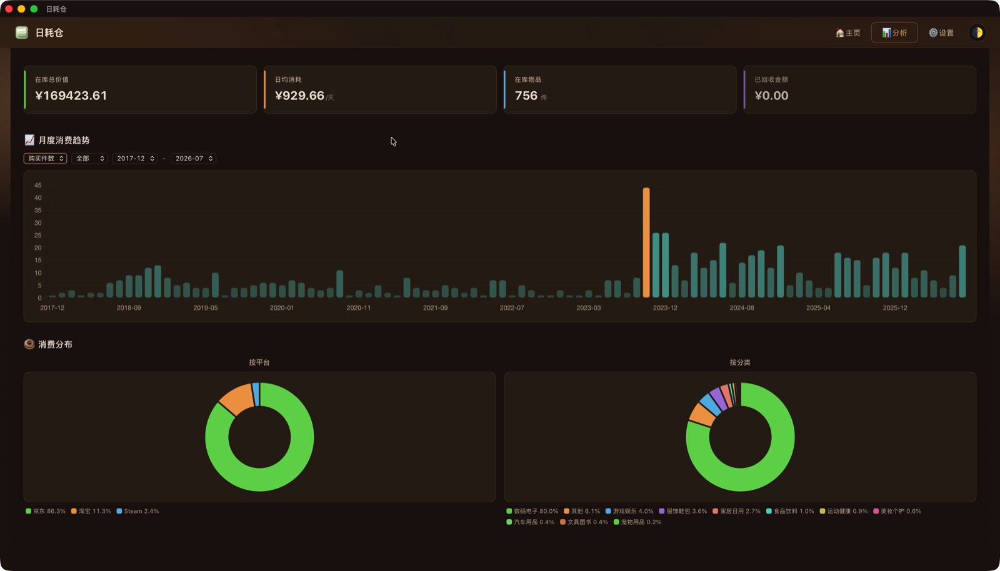

<p align="right">
  <a href="README.md"><b>简体中文</b></a> · <b>English</b>
</p>

<p align="center">
  <a href="https://bunnychen.top/BunnyChen-DailyCost/">
    
  </a>
</p>

<h1 align="center">
  <a href="https://bunnychen.top/BunnyChen-DailyCost/">日耗仓 · DailyCost Vault</a>
</h1>

<p align="center">
  <b>Your asset ledger — know the real daily cost of every item</b>
</p>

<p align="center">
  <i>"Bulk import, yours to control"</i>
</p>

<p align="center">
  
  
  
  
</p>

<p align="center">
  <a href="https://bunnychen.top/BunnyChen-DailyCost/"><b>🌐 Website</b></a> ·
  <a href="https://bunnychen.top/BunnyChen-Item-Bookkeeping/"><b>🖥️ Try Online</b></a> ·
  <a href="https://bunnychen.top/BunnyChen-DailyCost/getting-started/"><b>🚀 Getting Started</b></a> ·
  <a href="https://bunnychen.top/BunnyChen-DailyCost/import-csv/"><b>📥 Bulk Import</b></a> ·
  <a href="https://bunnychen.top/BunnyChen-DailyCost/FAQ/"><b>❓ FAQ</b></a> ·
  <a href="https://bunnychen.top/BunnyChen-DailyCost/PRIVACY/"><b>🔒 Privacy</b></a>
</p>

---

## 🎮 3-Second Intro

Turn scattered orders from **JD.com / Taobao / Steam / WeChat / Alipay** into a **visual asset ledger** in one click, with the **daily average cost** of every item calculated automatically:

> **Pay more but use it longer = worth it · Buy cheap but let it collect dust = wasted money**

---

## � Video Introduction

<p align="center">
  <iframe src="https://player.bilibili.com/player.html?isOutside=true&aid=117063712639931&bvid=BV1KZu16eE3v&cid=40738687283&p=1" scrolling="no" border="0" frameborder="no" framespacing="0" allowfullscreen="true" width="800" height="450" style="max-width:100%;border-radius:12px;"></iframe>
</p>

<p align="center">
  <a href="https://www.bilibili.com/video/BV1KZu16eE3v/" target="_blank" rel="noopener">
    
  </a>
</p>

---

## �💡 Why This Project?

Plenty of bookkeeping and asset-management tools already exist — yet most share the same frustrating flaws:

- 💸 **They charge** — the good features hide behind paywalls and only get pricier
- ⌨️ **They're manual** — you have to type every record by hand, and you're exhausted before you even start
- 🗂️ **They're scattered** — JD.com, Taobao, Steam, WeChat, and Alipay each keep their own records, so the full picture of your spending stays fragmented

But think about it: **every order you place on any platform already belongs to you.** It shouldn't be locked away in your purchase history, nor should you have to re-type it over and over.

That's why **DailyCost Vault** exists — a **free, easy-to-use, feature-rich** new app that gathers and organizes those scattered orders for you in one click, lets the data speak for itself, and helps you truly understand your own spending habits.

> It only hopes that, in some unexpected moment — maybe while reviewing your past, maybe while finally calculating what something really costs — you'll have an "aha!" moment, revisit your own history, and gain a little insight worth keeping. That alone makes it all worthwhile.

---

## 🚀 Quick Start

1. 📥 **Download & install** — [GitHub Releases](https://github.com/Lizhenghe-Chen/BunnyChen-DailyCost/releases) (or [🖥️ Try Online](https://bunnychen.top/BunnyChen-Item-Bookkeeping/))
2. Open the app and click "**Load sample data**" on the empty state
3. The page fills with sample items and analytics — you can clear them anytime

> 💡 A built-in **sample data pack** simulates a sample asset ledger — try it before you import any files.

---

## 📸 Preview

<p align="center">
  
  
</p>
<p align="center">
  
  
</p>

---

## ✨ Core Experience

**🧮 Pay more but use it longer = worth it** — the daily average cost is calculated per item: a ¥300 coat worn for 300 days costs just ¥1 a day; but a device left gathering dust burns money every single day.

- 📥 **One-click asset ledger** — batch import from JD.com / Taobao / Steam / WeChat / Alipay with auto-deduplication and auto category & emoji matching; scattered orders become an asset wall
- 🔄 **Full item lifecycle** — In Use / Sold / Retired; after selling, the real holding cost is auto-calculated as (buy price − sell price) ÷ days used
- 🎨 **Beautiful & customizable** — 3-state theme × 5 color schemes × custom emoji × platform colors
- 🌐 **Three languages** — 简体中文 / 繁體中文 / English
- 💾 **Fully local storage** — SQLite, data never leaves your device, zero server dependency
- 💖 **Completely free** — no subscriptions, no in-app purchases, no ads
- 🚀 **Continuously maintained** — new platforms and features keep rolling out

---

## 📥 Supported Platforms

### Data Sources · One-Click Batch Import

**✅ Now Supported**

- [X]  🐶 **JD.com** — one-click CSV export via the browser extension
- [X]  🛒 **Taobao / Tmall** — one-click CSV export via the browser extension
- [X]  🎮 **Steam** — one-click CSV export via the browser extension
- [X]  💬 **WeChat Bills** — "Download Bill" inside the WeChat app (CSV / Excel)
- [X]  💳 **Alipay** — "Transaction Details" export inside the Alipay app (CSV / Excel)

**⏳ Coming Soon (in the pipeline)**

- [ ]  🛍️ **Pinduoduo**
- [ ]  🐟 **Xianyu**
- [ ]  📱 **Douyin Mall**

> 💡 "Add Item" supports any platform (Tmall, Pinduoduo, Xianyu, Dewu, etc.) — not limited by the batch-import list above.

### Supported Devices


| Platform     | Status | Download                                                                                         |
| :------------- | :------: | :------------------------------------------------------------------------------------------------- |
| 🖥️ Windows |   ✅   | [`.exe` / `.msi`](https://github.com/Lizhenghe-Chen/BunnyChen-DailyCost/releases)                |
| 🍎 macOS     |   ✅   | [`.dmg` (Apple Silicon + Intel)](https://github.com/Lizhenghe-Chen/BunnyChen-DailyCost/releases) |
| 🐧 Linux     |   ✅   | [`.deb` / `.AppImage`](https://github.com/Lizhenghe-Chen/BunnyChen-DailyCost/releases)           |
| 🤖 Android   |   ✅   | [`.apk`](https://github.com/Lizhenghe-Chen/BunnyChen-DailyCost/releases)                         |
| 🌐 Web       |   ✅   | [bunnychen.top](https://bunnychen.top/BunnyChen-Item-Bookkeeping/)                               |
| 📱 iOS       |   🚧   | Coming soon                                                                                      |

---

## 🛠 Tech Stack


| Layer    | Technology                     |
| :--------- | :------------------------------- |
| Desktop  | **Tauri v2**                   |
| Frontend | **TypeScript** + Vite          |
| Backend  | **Rust**                       |
| Database | **SQLite** (rusqlite, bundled) |
| UI       | Vanilla HTML/CSS               |

---

## � Development · Run Locally

The source is now open source ([AGPL-3.0](LICENSE)). See the [🛠️ Development column](https://bunnychen.top/BunnyChen-DailyCost/development/) for the full dev & packaging guide.

**Requirements**: Node.js 22+ · pnpm 11+ · Rust (stable)

```bash
# 1. Clone the repo and enter the app directory
git clone https://github.com/Lizhenghe-Chen/BunnyChen-DailyCost.git
cd BunnyChen-DailyCost/BunnyChen-Item-Bookkeeping

# 2. Install dependencies
pnpm install

# 3. Browser-only dev (no Rust) → http://localhost:1420
pnpm dev

# 4. Desktop dev (Tauri window + hot-reload)
pnpm tauri dev

# 5. Rust backend compile check (inside src-tauri/)
cd src-tauri && cargo check
```

> 📖 Build & packaging (Web / Desktop / Android / iOS / browser extension) → [Development column](https://bunnychen.top/BunnyChen-DailyCost/development-build/)

---

## �🔒 Privacy & Security · Rest Assured

**DailyCost Vault runs fully offline, and all data stays on your device. BunnyChen has neither the interest nor any need to access any of your information.**

- 🖥️ Desktop → SQLite database in the `AppData` directory
- 🤖 Android → SQLite database in the app's private directory
- 🌐 Web → browser localStorage

❌ No data uploads · ❌ No tracking analytics · ❌ No reading of unrelated files

> 🗝️ **The source code is now open source (AGPL-3.0), and BunnyChen promises to never collect, upload, or pry into any of your data.** Your data belongs only to you — and please, **keep it safe yourself**.

See the [Privacy Policy](https://bunnychen.top/BunnyChen-DailyCost/PRIVACY/).

---

*Open source · GNU AGPL-3.0 · Your data will always belong only to you*

---

## ⭐ Star History

<a href="https://www.star-history.com/?repos=Lizhenghe-Chen%2FBunnyChen-DailyCost&type=date&legend=top-left">
 <picture>
   <source media="(prefers-color-scheme: dark)" srcset="https://api.star-history.com/chart?repos=Lizhenghe-Chen/BunnyChen-DailyCost&type=date&theme=dark&legend=top-left&sealed_token=XmlSuMJ1zoZUzwK_LUyZDTbv0TXF_g4upoBEsYjj4zr1TEJ5OheB-BUMEBq4Z9_OjVTP4dP8gxZ60GF4ikqItj7SQxLn5LplJ5kJ2k3QXwnfMGahmWmlIA" />
   <source media="(prefers-color-scheme: light)" srcset="https://api.star-history.com/chart?repos=Lizhenghe-Chen/BunnyChen-DailyCost&type=date&legend=top-left&sealed_token=XmlSuMJ1zoZUzwK_LUyZDTbv0TXF_g4upoBEsYjj4zr1TEJ5OheB-BUMEBq4Z9_OjVTP4dP8gxZ60GF4ikqItj7SQxLn5LplJ5kJ2k3QXwnfMGahmWmlIA" />
   
 </picture>
</a>

---

## ☕ Support · Buy Me a Coffee

Maintained single-handedly — if you like it, why not buy me a coffee? 🥺

<p align="center">
  
  
</p>

<p align="center">
  <a href="https://buymeacoffee.com/bunnychen">
    
  </a>
  
</p>

<p align="center">
  ☕ <b>Buy Me a Coffee</b>: <a href="https://buymeacoffee.com/bunnychen">buymeacoffee.com/bunnychen</a> · 🧧 <b>WeChat Donation</b>: scan any amount
</p>

---

## 🤝 Let's Collaborate

DailyCost Vault is currently developed and maintained independently. If you appreciate this project, here are ways to support it:

- 🧧 **Sponsorship** — help cover development and other costs
- 🤝 **Business Collaboration** — enterprise customization, platform integration, co-operation, etc.

---

<p align="center">
  <sub>© 2025–2026 BunnyChen · Made with ❤️</sub>
</p>

---

> 💬 Questions or suggestions? Feel free to open an [Issue](https://github.com/Lizhenghe-Chen/BunnyChen-DailyCost/issues).
