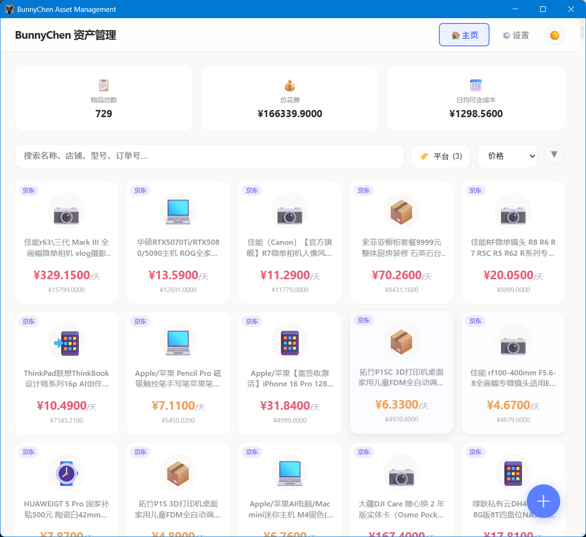
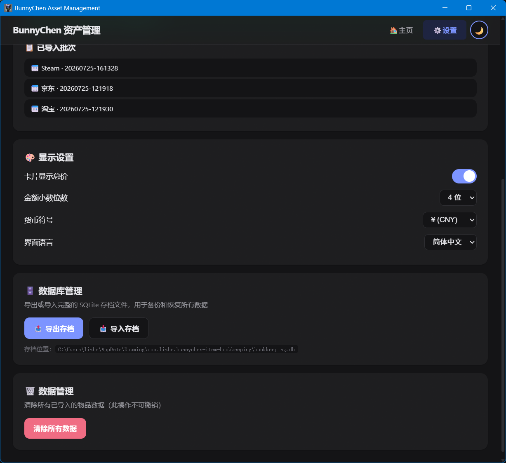
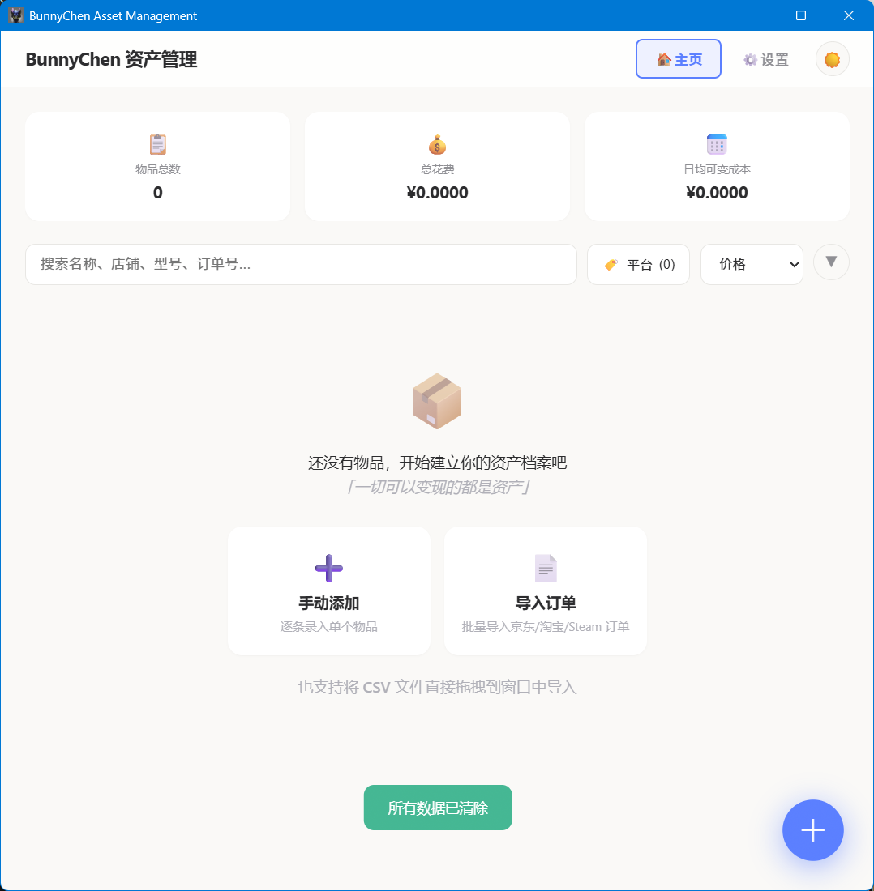
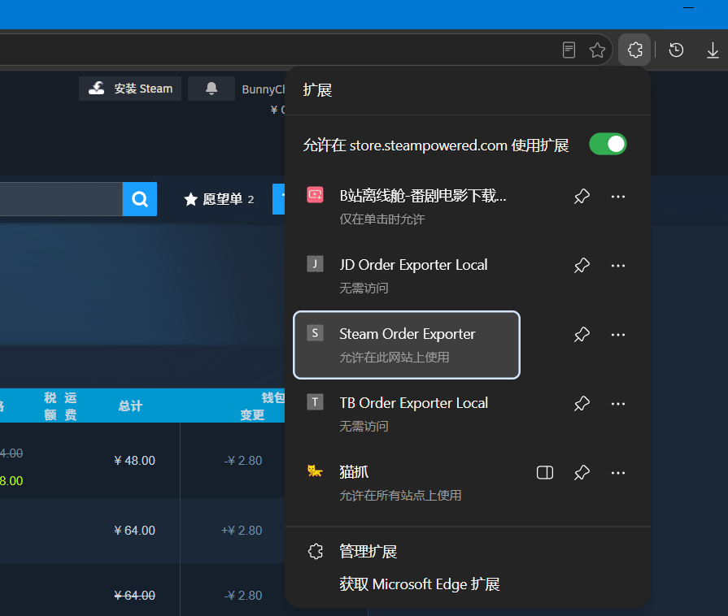
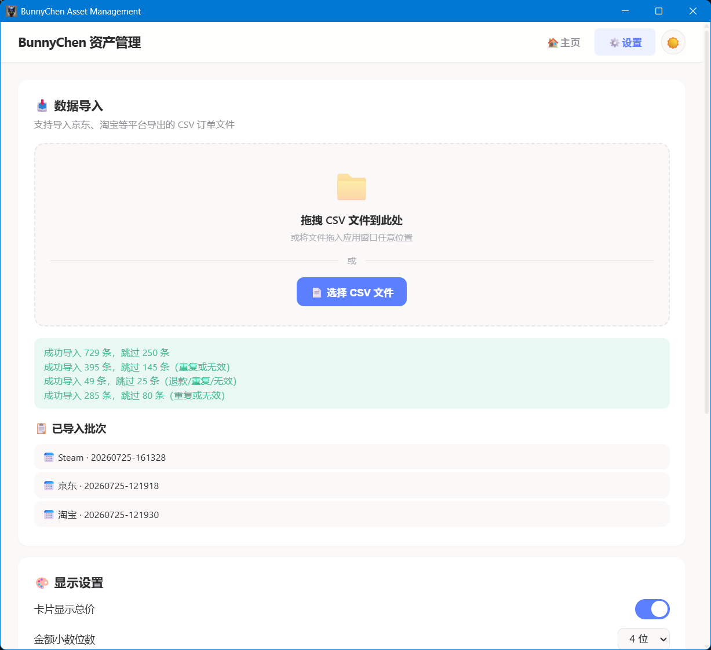
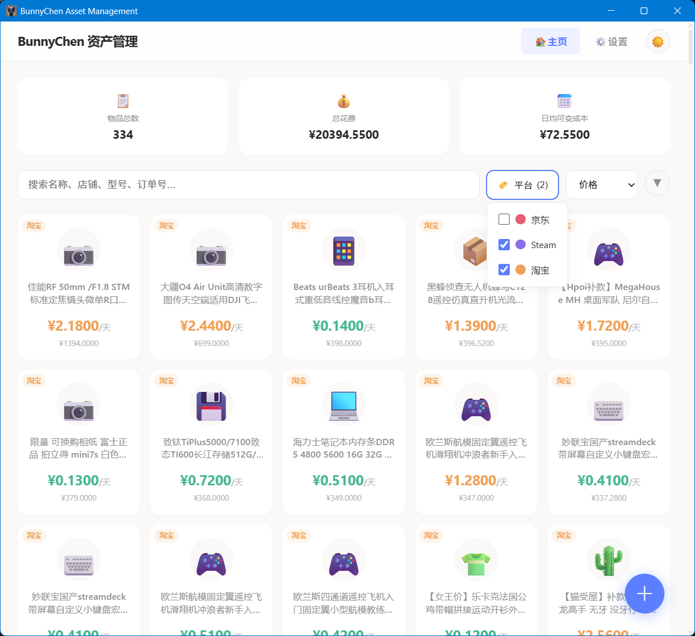

# 🏪 日耗仓 · DailyCost Vault

> **"一切可以变现的都是资产"** —— 长期主义个人资产数字化管理工具

日耗仓（DailyCost Vault）是一款**跨平台个人资产数字化管理工具**。它能自动将你在京东、淘宝、Steam 等平台的消费记录转化为直观的资产卡片，按「日均持有成本」帮你重新审视每一件物品的真实价值。

[]()
[](LICENSE)
[]()
[]()

> 🌐 **官方网站**：[bunnychen.top](https://bunnychen.top/BunnyChen-Item-Bookkeeping/) | 📖 [使用指南](https://bunnychen.top/BunnyChen-Item-Bookkeeping/USER_GUIDE/) | ❓ [常见问题](https://bunnychen.top/BunnyChen-Item-Bookkeeping/FAQ/)
>
> ⚠️ **公开测试阶段**：本软件目前处于开放 Beta 测试期，仅供个人免费使用。禁止商用、禁止剽窃仿冒。详见 [LICENSE](LICENSE)。

---

## 📸 预览

| 主页资产卡片 | 物品详情浮窗 |
|:---:|:---:|
|  |  |

| 设置页 | 手动添加物品 |
|:---:|:---:|
|  |  |

---

## ✨ 特色功能

### 📊 资产管理

- 🧮 **日均持有成本** —— 每件物品独立计算日均成本，买贵但用久 = 划算。按日均成本排序，一眼看出谁在「烧钱」
- 🏷️ **资产卡片网格** —— 每件物品一张精美卡片：平台徽章 + emoji 图标 + 物品名称 + 日均成本核心指标
- 📋 **顶部统计栏** —— 三张统计卡片：物品总数、总花费、日均可变成本，一目了然
- 🔍 **智能搜索** —— 按物品名称、店铺名称、型号款式、订单编号模糊搜索，✕ 按钮一键清空
- 🏷️ **平台筛选** —— 多选下拉框，勾选/取消勾选即可按平台过滤
- 📊 **三维排序** —— 时间 / 价格 / 日均成本排序，▲▼ 按钮切换升降序
- 👆 **回到顶部** —— 滚动超 400px 自动显示回到顶部按钮，平滑滚动

### 📥 数据导入

- 📄 **手动添加** —— FAB 浮动按钮快速添加单件物品，必填/可选字段分区，支持 emoji 图标选择
- 📦 **CSV 批量导入** —— 京东 / 淘宝 / Steam 三平台 CSV 一键批量导入
- 🖱️ **拖拽导入** —— 直接拖拽 CSV 文件到设置页或应用窗口任意位置
- 📁 **文件选择导入** —— 支持一次选择多个 CSV 文件批量导入
- 🔄 **自动去重** —— 同一平台 + 同一订单号自动跳过，不重复导入
- 🏪 **多商品订单合并** —— 同一订单内多件商品自动展开，子商品信息在详情中展示
- 🔗 **商品链接提取** —— 京东自动解析商品明细 JSON 提取链接，淘宝直接读取链接
- 🎯 **emoji 自动匹配** —— 35+ 关键词规则自动为商品匹配 emoji 图标，覆盖数码/服饰/个护/家居等品类

### 📦 物品生命周期管理

- ✅ **使用中** —— 正常计算日均成本，自动累加持有天数
- 💰 **已售出** —— 记录售出价格和截止日期，自动计算盈亏（支持增值盈利绿色显示）
- 🗑️ **已报废** —— 记录截止日期，自动核算真实损耗成本
- 📦 **归档管理** —— 物品软删除：从主页隐藏但数据永久保留，支持随时恢复
- ✅ **批量操作** —— 主页批量选择 + 一键归档；设置页批量取消归档/永久删除
- 🔒 **永久删除** —— 已归档物品可永久删除，需二次确认，不可撤销

### 🎨 个性化定制

- 🌓 **三态主题** —— 浅色 / 深色 / 跟随系统，一键循环切换
- 🎨 **5 套配色方案** —— 抹茶绿 / 天之蓝 / 莓之紫 / 桃之粉 / 橘之橙，浅色深色双模式完整适配
- 🌈 **平台自定义颜色** —— 每个平台独立设置徽章颜色，10 色调色板 + 自定义 HEX 输入
- 💱 **货币符号** —— 支持 ¥ / $ / € / £ / ₩ / ₹，独立于界面语言
- 🔢 **金额精度** —— 0-5 位小数自由设置
- 💰 **卡片总价开关** —— 可选择是否在卡片上显示购买总价
- 🎭 **自定义表情系统** —— 37 个自定义表情，4 大分类：
  - 🦜 **Party Parrots**（15 个经典鹦鹉 GIF 动画）
  - 🫧 **Reactions**（12 个 Blob 风格 SVG 表情）
  - 🐱 **Cats**（6 个猫咪 GIF 动画）
  - 🏷️ **Mascots**（Octocat + Star + Rocket + Fire）
- 😀 **emoji-mart 选择器** —— 完整 emoji 搜索，支持自定义表情分类，点击即选

### 🌐 国际化

- 🇨🇳 简体中文（默认）
- 🇹🇼 繁體中文
- 🇺🇸 English
- 语言切换即时生效，自动翻译全部界面元素（含 title/meta 描述）

### 💾 数据管理

- 💾 **完全本地存储** —— SQLite 数据库（桌面/Android）或 localStorage（网页），零服务器依赖
- 📤 **导出数据库** —— 一键导出 `.db` 备份文件到任意位置
- 📥 **导入数据库** —— 从备份文件恢复全部数据（验证→替换→重连）
- 🗑️ **清除所有数据** —— 需二次确认，不可撤销
- 📊 **导入批次追踪** —— 每次导入记录批次信息，方便回溯
- 📍 **数据库路径显示** —— 设置页显示 SQLite 文件完整路径，点击在文件管理器中定位

### 🔄 更新机制

- 🔄 **双通道更新** —— 桌面端 Tauri updater 自动下载安装 + GitHub API 全平台版本检测
- 🔔 **自动检查** —— 启动 3 秒后自动静默检查更新
- 👆 **手动检查** —— 设置页「检查更新」按钮
- 📲 **更新引导** —— Android/网页端发现新版本自动显示 Release 下载链接

### 🖥️ 用户体验

- ✨ **Splash 开场画面** —— 启动时 Logo + 标题 + 标语 + 加载动画，最低 200ms 防闪屏
- 🦴 **骨架屏加载** —— 首次加载时显示 6 张骨架卡片，数据就绪后平滑过渡
- 📭 **空状态引导** —— 无数据时双卡片引导：「手动添加」和「导入订单」入口
- 🔔 **Toast 通知** —— 右下角操作反馈，成功/失败/信息三态，3 秒自动消失
- ⚠️ **确认弹窗** —— 自定义美观确认对话框，危险操作二次确认
- ⌨️ **键盘支持** —— ESC 关闭浮窗
- 📱 **响应式布局** —— ≥1200px 固定 5 列，≤640px 2 列，移动端底部抽屉式浮窗
- 📐 **安全区适配** —— iPhone 刘海屏/Home 指示条自动 padding，全面屏完美显示
- 🎞️ **页面切换动画** —— 设置页左右滑动动画（0.28s cubic-bezier 缓动），主页零开销渲染

---

## 📥 下载安装

| 平台 | 状态 | 获取方式 |
|------|:---:|----------|
| 🖥️ Windows | ✅ 已支持 | [Releases](https://github.com/Lizhenghe-Chen/BunnyChen-DailyCost/releases) 下载 `.exe` / `.msi` |
| 🤖 Android | ✅ 已支持 | [Releases](https://github.com/Lizhenghe-Chen/BunnyChen-DailyCost/releases) 下载 `.apk` |
| 🌐 网页版 | ✅ 已支持 | [bunnychen.top](https://bunnychen.top/BunnyChen-Item-Bookkeeping/) 直接访问 |
| 🍎 macOS | ✅ 已支持 | [Releases](https://github.com/Lizhenghe-Chen/BunnyChen-DailyCost/releases) 下载 `.dmg`（Apple Silicon + Intel） |
| 🐧 Linux | ✅ 已支持 | [Releases](https://github.com/Lizhenghe-Chen/BunnyChen-DailyCost/releases) 下载 `.deb` / `.AppImage` |
| 📱 iOS | 🚧 规划中 | 敬请期待 |

### 🖥️ Windows

下载 `DailyCost Vault_*_x64-setup.exe` 或 `.msi` 安装包，双击安装即可。支持 x64 和 ARM64 架构。

> 支持 Windows 10 及以上系统。如果出现 SmartScreen 警告，点击「更多信息」→「仍要运行」。

### 🍎 macOS

下载对应芯片的 `.dmg` 文件（Apple Silicon 或 Intel），将 `DailyCost Vault.app` 拖入「应用程序」文件夹。

### 🐧 Linux

下载 `.deb` 包或 `.AppImage` 文件。`.deb` 包执行 `sudo apt install ./dailycost-vault_*.deb` 安装，`.AppImage` 执行 `chmod +x` 后即可运行。

下载 `.dmg` 文件（Apple Silicon 选 `aarch64`，Intel 选 `x64`），将 `DailyCost Vault.app` 拖入「应用程序」文件夹。

> 如果提示「已损坏，无法打开」，打开终端执行：`sudo xattr -rd com.apple.quarantine /Applications/DailyCost\ Vault.app`

### 🤖 Android

下载 `.apk` 文件，在手机设置中允许「安装未知来源应用」后安装。

> 支持 Android 8.0 及以上系统。

### 🌐 网页版

无需安装，直接访问 [bunnychen.top/BunnyChen-Item-Bookkeeping](https://bunnychen.top/BunnyChen-Item-Bookkeeping/)。

> 网页版数据存储在浏览器本地，清除浏览器数据会导致数据丢失，建议定期导出备份。

---

## 🚀 快速开始

### 手动添加物品

如果你只是想录入个别物品：

1. 启动应用，点击右下角 **➕ 浮动按钮**
2. 填写物品名称、平台、价格、购买日期
3. 可选：选择 emoji 图标、填写店铺/型号/链接等
4. 点击「保存」，系统自动计算日均成本并生成资产卡片


### 批量导入订单

如果你有大量历史订单（京东 / 淘宝 / Steam），可通过浏览器扩展批量导出再导入：

#### 第一步：安装浏览器扩展

1. 打开 Chrome，进入 `chrome://extensions/`
2. 开启右上角「**开发者模式**」
3. 点击「**加载已解压的扩展程序**」
4. 选择下载的扩展文件夹（`jd-order-exporter-extension` / `tb-order-exporter-extension` / `steam-order-exporter-extension`）


#### 第二步：导出 CSV

1. 在 Chrome 中打开对应平台的订单页面，确认已登录
2. 点击浏览器工具栏的扩展图标 🧩，选择对应扩展
3. 配置日期范围、订单状态等选项，点击「开始导出」
4. 浏览器自动下载 CSV 文件



> 🔒 扩展仅在你本机浏览器中运行，不上传任何数据到第三方。

#### 第三步：导入到日耗仓

1. 点击底部「⚙️ 设置」→「📄 选择 CSV 文件」或直接拖拽 CSV 文件到页面
2. 支持一次选择多个 CSV 文件批量导入
3. 导入结果会以 Toast 提示：成功 X 条，跳过 X 条（已存在数据自动去重）



---

## 💡 核心概念：日均持有成本

> **日均持有成本 = 购买价格 ÷ 已持有天数**

一件 ¥365 的物品用了 365 天，日均成本就是 ¥1.00。这个数字越小，说明东西越「值」。

按日均成本降序排列，排在最前面的就是每天「烧钱」最多的物品——帮你科学断舍离。

**物品截止场景**：

| 状态 | 计算方式 |
|------|----------|
| 使用中 | 总价 ÷ 购买至今的天数 |
| 已售出 | (总价 - 售出价) ÷ (截止日 - 购买日) |
| 已报废 | 总价 ÷ (截止日 - 购买日) |

---

## 📖 使用指南

详细操作指南请参阅 [USER_GUIDE.md](USER_GUIDE.md)。

### 浏览与管理资产

主页以卡片网格展示所有物品，每张卡片显示：

```
┌──────────────────────┐
│ 🔴 平台徽章          │
│ 📱 emoji 图标        │
│ 物品名称             │
│ 日均 ¥12.33          │  ← 核心指标
└──────────────────────┘
```

- **顶部统计栏**：物品总数 / 总花费 / 日均可变成本
- **搜索框**：支持名称、店铺、型号、订单号模糊搜索
- **平台筛选**：多选下拉框，按平台过滤
- **排序切换**：时间 / 价格 / 日均成本，升降序可切换



点击任意卡片查看完整详情，支持编辑和归档操作。

### 数据备份

在设置页可进行数据备份与恢复：

| 操作 | 说明 |
|------|------|
| 📤 导出数据库 | 将所有数据打包导出为 `.db` 备份文件 |
| 📥 导入数据库 | 从备份文件恢复数据（替换当前数据） |
| 🗑️ 清除所有数据 | 清空所有物品数据（需二次确认） |

### 个性化设置

- 🎨 **主题切换**：浅色 / 深色 / 跟随系统
- 🌈 **平台颜色**：为不同平台自定义徽章颜色
- 🌐 **界面语言**：简体中文 / 繁體中文 / English
- 💱 **货币符号**：自定义显示的货币符号（默认 ¥）
- 🔢 **小数位数**：金额显示精度（0-5 位）

---

## 🔒 隐私安全

日耗仓**完全离线运行**，所有数据存储在本地：

- **桌面端**：数据存储在 `AppData` 下的 SQLite 数据库文件
- **Android**：数据存储在应用私有目录的 SQLite 数据库
- **网页版**：数据存储在浏览器 localStorage

**我们不会**：
- ❌ 上传你的订单数据到任何服务器
- ❌ 使用任何分析或追踪工具
- ❌ 读取与应用无关的文件

浏览器扩展同样仅在你本机运行，导出完成后可以随时从 Chrome 中移除。详见 [PRIVACY.md](PRIVACY.md)。

---

## ❓ 常见问题

详见 [FAQ.md](FAQ.md)。

<details>
<summary><b>Q: 导入时提示「跳过 N 条」是什么原因？</b></summary>

系统会自动去重：同一个平台下相同订单编号的数据不会重复导入。再次导入同一份 CSV 时，已有记录会被自动跳过。
</details>

<details>
<summary><b>Q: 支持哪些平台的数据导入？</b></summary>

目前支持京东、淘宝/天猫、Steam 三个平台。其他平台可通过「手动添加」逐条录入。
</details>

<details>
<summary><b>Q: 数据如何迁移到新设备？</b></summary>

在设置页使用「导出数据库」生成 `.db` 备份文件，将文件传输到新设备后使用「导入数据库」恢复。
</details>

<details>
<summary><b>Q: 日均成本怎么算的？</b></summary>

日均成本 = 购买价格 ÷ 从购买日到今天的总天数。已售出物品 = (购买价 - 卖出价) ÷ 持有天数。详见上方[核心概念](#-核心概念日均持有成本)。
</details>

---

## 🛠 技术栈

| 层级 | 技术 |
|------|------|
| 桌面框架 | Tauri v2 |
| 前端 | TypeScript + Vite |
| 后端 | Rust |
| 数据库 | SQLite (rusqlite, bundled) |
| UI | Vanilla HTML/CSS |

---

## 📄 许可

本项目处于公开测试（Beta）阶段，采用[自定义源码可用许可](LICENSE)：

- ✅ **个人免费使用** —— 下载、安装、使用完全免费
- ✅ **源码学习** —— 欢迎查阅源码、提交 Issue 和 PR
- ❌ **禁止商用** —— 未经授权不得用于商业目的
- ❌ **禁止剽窃** —— 不得复制源码/设计以其他名称发布，不得用于竞品开发

Beta 阶段结束后许可条款可能调整，届时将通过仓库公告通知。

---

> 💬 有问题或建议？欢迎提交 [Issue](https://github.com/Lizhenghe-Chen/BunnyChen-DailyCost/issues)。
