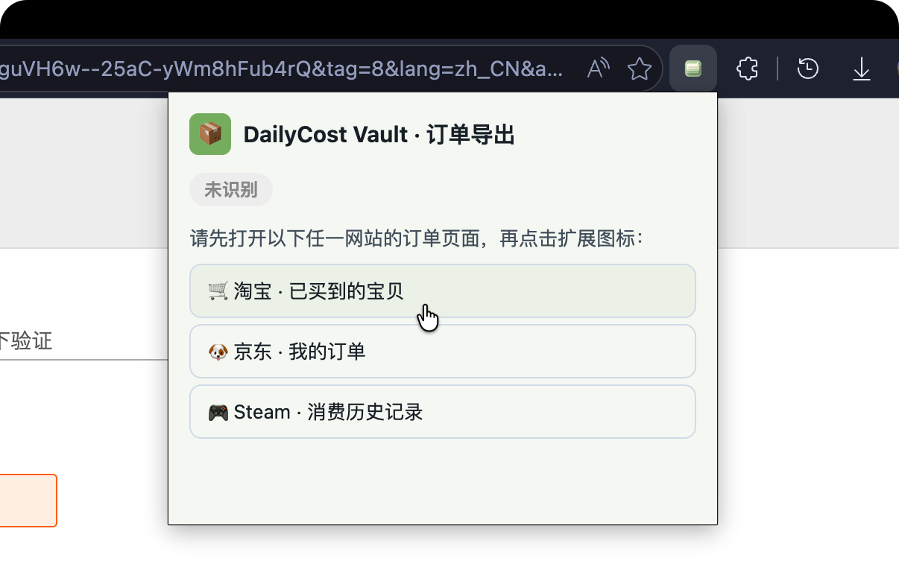
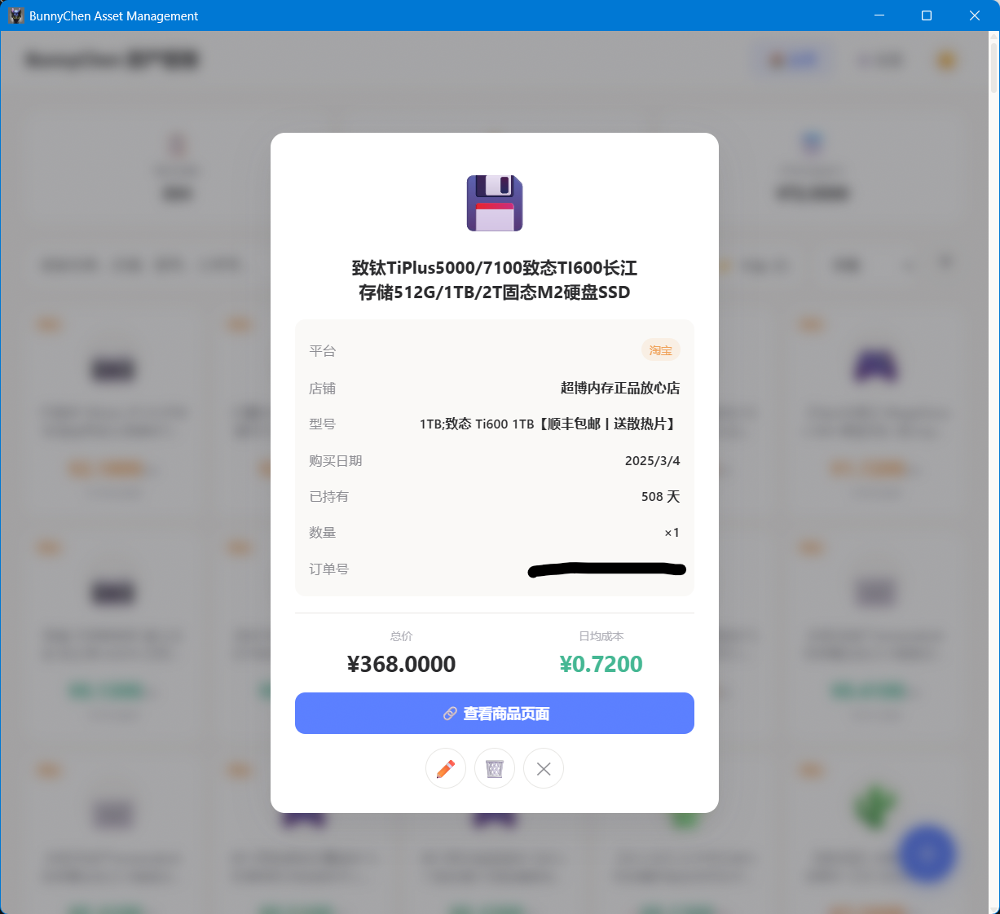
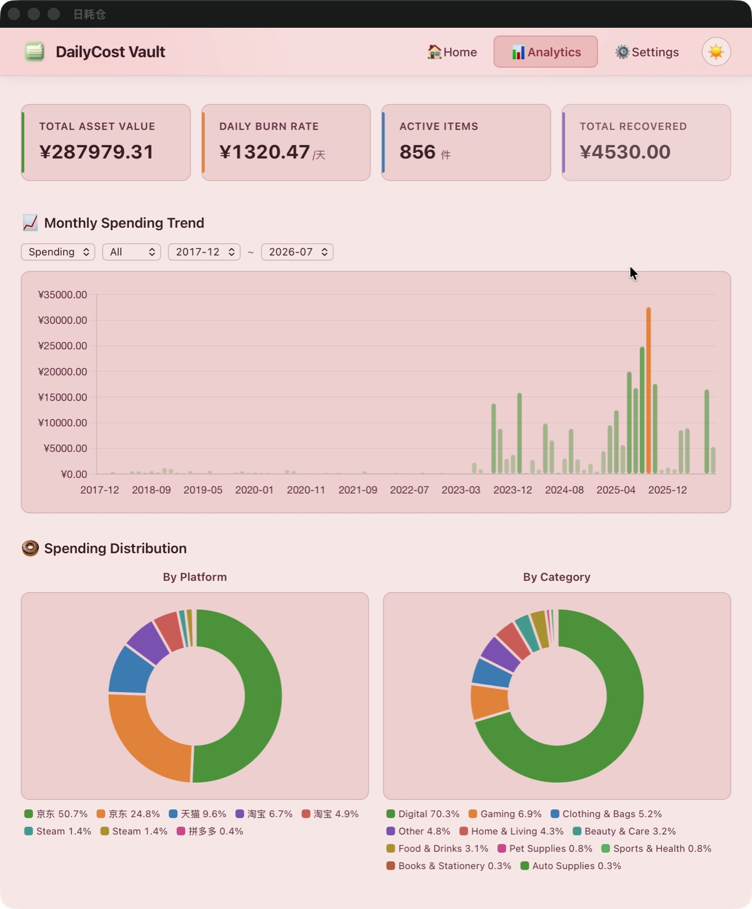
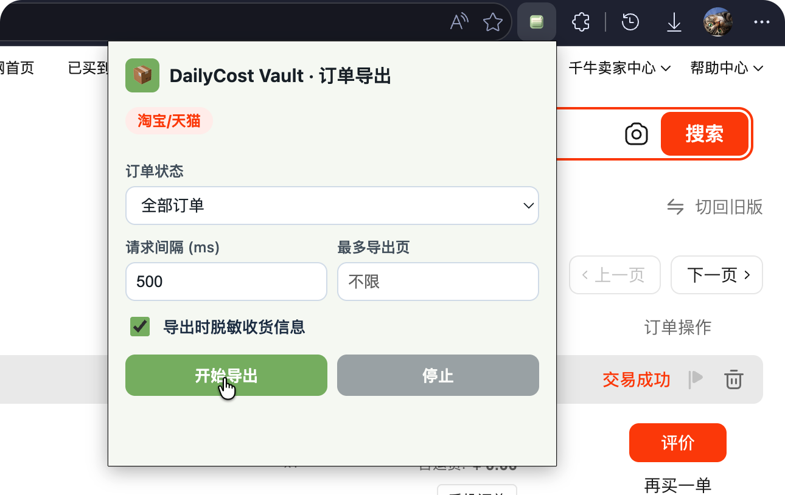

# 📖 使用指南（User Guide）

日耗仓（DailyCost Vault）操作手册，涵盖安装、导入、管理、备份等全部功能。

---

## 安装与启动

### Windows 桌面端

1. 前往 [Releases](https://github.com/Lizhenghe-Chen/BunnyChen-DailyCost-Releases/releases) 页面
2. 下载 `DailyCost Vault_*_x64-setup.exe`（推荐）或 `.msi` 安装包
3. 双击运行安装程序，按照向导完成安装
4. 从开始菜单或桌面快捷方式启动「日耗仓」

> 💡 **SmartScreen 提示**：首次运行时 Windows 可能弹出 SmartScreen 警告，点击「更多信息」→「仍要运行」即可。

### Android

1. 前往 [Releases](https://github.com/Lizhenghe-Chen/BunnyChen-DailyCost-Releases/releases) 页面
2. 下载 `.apk` 文件
3. 打开下载的文件，系统会提示「禁止安装未知应用」
4. 前往「设置」→ 允许来自此来源的安装
5. 返回安装界面完成安装

> 💡 安装完成后建议关闭「未知来源」权限。

### 网页版

直接访问 [bunnychen.top/BunnyChen-Item-Bookkeeping](https://bunnychen.top/BunnyChen-Item-Bookkeeping/)，无需安装。

> ⚠️ 网页版数据存储在浏览器本地。清除浏览器缓存/数据会导致数据丢失，请定期导出备份。

---

## 添加资产

### 手动添加物品

适合录入个别物品，或电商平台暂不支持批量导出的情况。

**操作步骤**：

1. 点击右下角的 **➕ 浮动按钮**（FAB）
2. 在弹出表单中填写物品信息：

| 字段 | 是否必填 | 说明 |
|------|:---:|------|
| 产品名称 | ✅ | 物品名称，如「iPhone 16 Pro」 |
| 图标 | — | 点击选择 emoji 图标，支持自定义表情 |
| 平台 | ✅ | 下拉选择（京东 / 淘宝 / Steam / 其他等） |
| 购买日期 | ✅ | 用于计算持有天数 |
| 总价 | ✅ | 购买时的实付金额 |
| 数量 | ✅ | 物品数量 |
| 店铺 | — | 购买店铺名称 |
| 型号款式 | — | 颜色、规格等 |
| 商品链接 | — | 电商平台商品链接 |
| 使用状态 | — | 使用中 / 已售出 / 已报废 |

3. 点击「**保存**」，系统自动计算日均成本并生成资产卡片


**使用状态说明**：

| 状态 | 说明 | 额外字段 |
|------|------|----------|
| 使用中 | 正在正常使用的物品 | — |
| 已售出 | 已二手卖出 | 截止日期、售出价格 |
| 已报废 | 已无法使用或丢弃 | 截止日期 |

---

### 批量导入订单数据

如果你在京东、淘宝、Steam 有大量历史订单，可以通过浏览器扩展批量导出 CSV 文件，再导入到日耗仓。

#### 前置准备：安装浏览器扩展

> 扩展文件存放在下载的压缩包中，目录名分别为 `jd-order-exporter-extension`、`tb-order-exporter-extension`、`steam-order-exporter-extension`。

1. 打开 Chrome 浏览器，地址栏输入 `chrome://extensions/`
2. 开启右上角「**开发者模式**」
3. 点击「**加载已解压的扩展程序**」
4. 选择对应平台的扩展目录，点击「选择文件夹」
5. 扩展安装完成，工具栏会出现对应图标


> 💡 导出完成后可以在 `chrome://extensions/` 中移除扩展，不影响已导出的 CSV 文件。

---

#### 京东订单导出

1. 在 Chrome 中打开 [京东我的订单](https://order.jd.com/center/list.action)，确认已登录
2. 点击浏览器工具栏的扩展图标 🧩，选择「JD Order Exporter」
3. 配置导出选项：
   - **日期范围**：建议按年份分段导出（如 2024 年、2025 年），减少风控概率
   - **订单状态**：建议只勾选「已完成」
   - **包含详情页字段**：建议勾选，获取更完整的物流和支付信息
   - **脱敏**：默认勾选，保护收货人隐私
4. 点击「**开始导出**」
5. 进度显示在页面右下角，完成后浏览器自动下载 CSV 文件

> 💡 **按年份分批导出**可大幅降低被京东风控拦截的概率。导出的 CSV 文件命名格式为 `jd-orders-YYYYMMDD-HHmmss-complete.csv`。

#### 淘宝订单导出

1. 在 Chrome 中打开 [淘宝已买到的宝贝](https://buyertrade.taobao.com/trade/itemlist/list_bought_items.htm)，确认已登录
2. 点击扩展图标 🧩，选择「TB Order Exporter」
3. 配置导出选项（同京东）
4. 点击「**开始导出**」

> 💡 淘宝扩展通过页面内部接口获取数据，零网络开销。导出的 CSV 文件命名格式为 `tb-orders-YYYYMMDD-HHmmss-complete.csv`。

#### Steam 订单导出

1. 在 Chrome 中打开 [Steam 消费历史记录](https://store.steampowered.com/account/history)，确认已登录
2. 点击扩展图标 🧩，选择「Steam Order Exporter」
3. 直接点击「**开始导出**」，无需配置额外选项
4. Steam 扩展自动分页拉取全部消费历史

> ⚠️ Steam 导出会将退款和钱包充值记录一并导出，导入日耗仓时会自动过滤这些记录。导出的 CSV 文件命名格式为 `steam-orders-YYYYMMDD-HHmmss-complete.csv`。



---

#### 导入 CSV 到日耗仓

##### 方式一：文件选择导入

1. 点击底部导航栏「**⚙️ 设置**」切换到设置页
2. 在「数据导入」区域，点击「**📄 选择 CSV 文件**」按钮
3. 在文件选择对话框中，按住 Ctrl 多选你要导入的 CSV 文件
4. 点击「打开」，导入自动开始

##### 方式二：拖拽导入

直接将 CSV 文件从文件管理器拖拽到设置页「数据导入」区域即可，支持一次拖拽多个文件。

**导入结果**：

- 右下角弹出 Toast 提示：`成功 X 条，跳过 X 条`
- 「跳过」表示该订单已存在（同一平台 + 同一订单号），系统自动去重


**导入后发生了什么？**

- ✅ 系统自动识别平台（京东 / 淘宝 / Steam）
- ✅ 过滤非完成状态订单（待付款、已取消等不导入）
- ✅ 为每件商品自动匹配合适的 emoji 图标
- ✅ 提取京东商品的详细链接
- ✅ 同一笔订单的多件商品自动展开（子商品信息在详情弹窗展示）
- ✅ 自动去重（同一平台 + 同一订单号不重复导入）

---

## 浏览与管理资产

### 主页布局

主页面是应用的核心界面，由以下几个区域组成：

```
┌──────────────────────────────┐
│  📋 物品总数  💰 总花费  📅 日均可变成本 │  ← 顶部统计栏
├──────────────────────────────┤
│  🔍 搜索框  [平台筛选▼]  [排序▼] [▲▼] │  ← 筛选搜索栏
├──────────────────────────────┤
│  ┌──────┐ ┌──────┐ ┌──────┐ │
│  │ 卡片1│ │ 卡片2│ │ 卡片3│ │  ← 卡片网格
│  └──────┘ └──────┘ └──────┘ │
│  ┌──────┐ ┌──────┐          │
│  │ 卡片4│ │ 卡片5│  ...     │
│  └──────┘ └──────┘          │
├──────────────────────────────┤
│  🏠主页   📊分析   ⚙️设置   │  ← 底部导航栏
└──────────────────────────────┘
                              ➕  ← 浮动添加按钮
```


### 筛选与搜索

| 控件 | 功能 | 操作方式 |
|------|------|----------|
| 🔍 搜索框 | 模糊搜索物品名称、店铺、型号、订单号 | 输入关键词实时过滤；✕ 按钮一键清空 |
| 🏷️ 平台筛选 | 按电商平台过滤 | 点击下拉框，勾选/取消勾选平台 |
| 📊 排序方式 | 按时间/价格/日均成本排序 | 下拉选择排序字段 |
| ▲▼ 排序方向 | 切换升降序 | 点击箭头按钮切换 |


> 💡 搜索框支持订单编号搜索。买完东西想不起来在哪家店买的？搜一下订单号即可。

> 💡 搜索或筛选无结果时，页面会显示引导提示并区分场景（纯关键词/纯平台/叠加），提供「清除所有筛选」按钮。

### 物品详情与编辑

点击任意卡片，弹出详情浮窗，展示完整信息：

- **基本信息**：名称、平台、emoji 图标
- **成本数据**：购买价格、日均成本、已持有天数
- **补充信息**：店铺、型号款式、商品链接
- **使用状态**：使用中 / 已售出 / 已报废，含截止日期和售出价格



在详情浮窗中可以：

| 操作 | 按钮 | 说明 |
|------|:---:|------|
| 📝 编辑 | 「编辑」按钮 | 修改物品任意字段 |
| 📦 归档 | 「📦」按钮 | 将物品从主页隐藏（数据保留） |
| 🗑️ 删除 | 「🗑️」按钮 | 永久删除（仅已归档物品可用） |

---

### 归档管理

归档是对物品进行「软删除」的机制——物品不再显示在主页，但数据永久保留。

**归档物品**：
- 在物品详情浮窗点击「📦」按钮
- 物品从主页消失，移入设置页的归档管理列表

**取消归档**：
- 在设置页的「归档管理」区域
- 找到已归档物品，点击「📥」按钮恢复

**永久删除**：
- 仅已归档物品可以永久删除
- 在物品详情浮窗点击「🗑️」按钮，确认后不可恢复

> ⚠️ 永久删除操作不可撤销，建议先确认物品确实不再需要。

### 批量操作

在主页点击「选择」进入批量选择模式：

1. 勾选需要操作的物品卡片
2. 底部浮现批量操作栏
3. 点击「批量归档」一键处理

在设置页归档管理中同样支持批量「取消归档」和「批量永久删除」。

---

## 数据分析

切换到底部导航栏的「📊 分析」页，直观洞察你的消费结构：


| 模块 | 说明 |
|------|------|
| 📊 KPI 概览 | 总资产价值、日均消耗、在用品数量、已回收总额，一眼尽览 |
| 📈 月度趋势 | 月度消费图表，支持平台 / 时间筛选与图表类型切换 |
| 🔍 下钻查看 | 点击柱状图中的月份，可下钻查看当月消费明细 |
| 🥧 平台占比 | 平台消费占比饼图，清晰呈现消费结构 |

移动端同样提供完整的数据分析体验：



> 💡 月度图表支持按平台和时间筛选，切换柱状图 / 折线图视图；点击某个月份可下钻到当月商品明细。

---

## 个性化设置

切换到「⚙️ 设置」页进行个性化配置：


### 主题与外观

| 设置项 | 选项 | 说明 |
|--------|------|------|
| 主题模式 | 浅色 / 深色 / 跟随系统 | 应用整体明暗配色，点击右上角 🌓 按钮快速切换 |
| 配色方案 | 抹茶绿 / 天之蓝 / 莓之紫 / 桃之粉 / 橘之橙 | 5 套完整配色，浅色深色双模式独立设计 |
| 平台颜色 | 自定义 HEX 颜色 | 每个平台独立设置徽章颜色，10 色调色板 + 自定义输入 |
| 卡片显示总价 | 开关 | 控制卡片上是否显示购买总价 |
| 小数位数 | 0-5 | 金额显示的精度 |

### Emoji 图标系统

日耗仓内置丰富的图标系统：

- **Unicode Emoji**：emoji-mart 完整选择器，支持关键词搜索
- **自定义表情**：4 大分类共 37 个：
  - 🦜 Party Parrots — 15 个经典动画鹦鹉 GIF（party/conga/deal-with-it 等）
  - 🫧 Reactions — 12 个 Blob 风格 SVG 表情（think/wow/cool/love/laugh/cry 等）
  - 🐱 Cats — 6 个猫咪动画 GIF（vibing/happy/serious/banana/huh/pop）
  - 🏷️ Mascots — Octocat + Star + Rocket + Fire
- **自动匹配**：导入 CSV 时根据商品名称关键词自动匹配 emoji（覆盖数码/服饰/个护/家居等 35+ 品类）


### 快捷操作

| 操作 | 方式 |
|------|------|
| 关闭浮窗 | 点击遮罩层 / 点击 ✕ 按钮 / 按 ESC 键 |
| 回到顶部 | 主页滚动超 400px 后右下角出现 ↑ 按钮 |
| 清空搜索 | 搜索框右侧 ✕ 按钮 |
| 快速切换主题 | 顶部导航栏右侧 🌓 按钮 |

### 语言与货币

| 设置项 | 选项 | 说明 |
|--------|------|------|
| 界面语言 | 简体中文 / 繁體中文 / English | 切换后即时生效，自动翻译全部界面 |
| 货币符号 | ¥ / $ / € / £ / ₩ / ₹ | 自定义显示的货币符号，独立于语言设置 |
| 配色方案 | 🍵 抹茶绿 / ☁️ 天之蓝 / 🫐 莓之紫 / 🍑 桃之粉 / 🍊 橘之橙 | 5 套完整主题配色 |

### 平台颜色

在设置页中，每个平台旁边有一个色点按钮，点击打开颜色选择器：

- 预设 10 种调色板颜色
- 支持输入自定义 HEX 颜色值
- 修改后即时生效，卡片徽章和详情标签同步更新

---

## 数据管理

### 导入批次

每次 CSV 导入都会创建一个导入批次，在设置页「导入批次」区域显示，方便回溯每次导入了哪些数据。

### 数据库路径

桌面端在设置页底部显示 SQLite 数据库文件的完整路径，**点击路径文字**可在文件管理器中定位文件，方便手动备份。

### 备份与恢复

| 操作 | 按钮 | 说明 |
|------|------|------|
| 📤 导出数据库 | 「导出数据库」 | 将所有数据打包为 `.db` 文件下载 |
| 📥 导入数据库 | 「导入数据库」 | 选择 `.db` 备份文件恢复数据 |
| 🗑️ 清除所有数据 | 「清除所有数据」 | 清空数据库，需二次确认 |

> ⚠️ **导入数据库会替换当前所有数据**，建议先导出当前数据作为备份。
>
> ⚠️ **清除所有数据不可撤销**，操作前请务必先导出备份。

### 数据迁移

**桌面端 → 桌面端**：
1. 在旧设备上导出数据库（`.db` 文件）
2. 将文件传输到新设备
3. 在新设备上导入数据库

**桌面端 ↔ Android**：
1. 在旧设备上导出数据库
2. 通过文件传输工具（微信/QQ/网盘等）发送到新设备
3. 在新设备上导入数据库

**Android 数据库文件位置**：应用私有目录下的 SQLite 文件，可通过设置页「导出数据库」获取。

---

## 更新应用

### 桌面端（Windows）

日耗仓内置自动更新功能：

- **自动检测**：启动 3 秒后自动检查更新
- **自动安装**：发现新版本自动下载并安装，安装完成后提示重启
- **手动检查**：在设置页点击「检查更新」按钮

> 💡 如果自动更新通道不可用，会引导你前往 GitHub Releases 手动下载最新安装包。

### Android / 网页版

前往 [Releases](https://github.com/Lizhenghe-Chen/BunnyChen-DailyCost-Releases/releases) 页面查看是否有新版本：

- **Android**：下载新 `.apk` 文件覆盖安装
- **网页版**：刷新页面即可获取最新版本

---

## 浏览器扩展使用

### 数据获取工具

浏览器扩展内置「数据获取工具」，引导你快速完成订单数据的获取与下载：


**引导页** — 打开扩展后自动识别当前访问的电商平台，一步步引导你完成数据获取，不熟悉操作也能轻松上手。



**下载页** — 获取完成的订单数据集中展示，一键下载 CSV / JSONL 文件，按平台与时间批次自动命名，直接拖入日耗仓即可导入。

### 通用安全提示

> 🔒 所有浏览器扩展仅在你本机 Chrome 浏览器中运行，不会上传任何数据到第三方服务器。
>
> - 扩展不读取浏览器 cookie、密码或其他站点数据
> - 导出完成后可在 `chrome://extensions/` 中移除扩展
> - 不要将导出的 CSV 文件提交到 GitHub 或发送给不可信的人
>
> 💡 **建议用完即删**：导出完订单后即可移除扩展，下次需要时再安装。

### 京东订单导出

| 项目 | 说明 |
|------|------|
| 扩展目录 | `jd-order-exporter-extension/` |
| 订单页面 | [order.jd.com/center/list.action](https://order.jd.com/center/list.action) |
| 导出字段 | 27 个（订单信息 + 商品信息 + 支付物流 + 详情补充） |
| 风控建议 | 按年份分段导出，避免一次性全量拉取 |

### 淘宝订单导出

| 项目 | 说明 |
|------|------|
| 扩展目录 | `tb-order-exporter-extension/` |
| 订单页面 | [buyertrade.taobao.com](https://buyertrade.taobao.com/trade/itemlist/list_bought_items.htm) |
| 导出字段 | 23 个（订单信息 + 商品信息 + 支付物流 + 详情补充） |
| 技术特点 | 通过页面内部接口获取数据，零网络开销 |

### Steam 订单导出

| 项目 | 说明 |
|------|------|
| 扩展目录 | `steam-order-exporter-extension/` |
| 订单页面 | [store.steampowered.com/account/history](https://store.steampowered.com/account/history) |
| 导出字段 | 交易ID / 日期 / 物品名称 / 类型 / 总计 |
| 自动过滤 | 退款记录和钱包充值（总计 ≤ 0）在导入时自动过滤 |

---

> 更多问题？请查看 [FAQ](FAQ/) 或提交 [Issue](https://github.com/Lizhenghe-Chen/BunnyChen-DailyCost-Releases/issues)。
