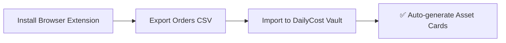

# 📥 Import CSV Orders

!!! tip "⭐ Recommended First Step"
    If you have purchase history on JD.com, Taobao, or Steam, CSV batch import is the **fastest and recommended** way to populate your assets. One import handles platform detection, emoji matching, and deduplication automatically — no manual entry needed.

---

## Overall Process

---

## Step 1: Install Browser Extensions

Browser extensions export order data from e-commerce platforms as CSV files. Supports **Chrome**, **Edge**, and all Chromium-based browsers.

!!! info "Extension File Location"
    Extension files are in the downloaded package, containing three extension directories:
    
    | Extension | Directory Name |
    |-----------|---------------|
    | JD.com | `jd-order-exporter-extension/` |
    | Taobao | `tb-order-exporter-extension/` |
    | Steam | `steam-order-exporter-extension/` |

### Chrome Installation

1. Open Chrome, enter `chrome://extensions/` in the address bar
2. Enable "**Developer mode**" (top-right toggle)
3. Click "**Load unpacked**"
4. Select the platform's extension directory, click "Select Folder"
5. Extension installed — the icon appears in the toolbar

### Edge Installation

1. Open Edge, enter `edge://extensions/` in the address bar
2. Enable "**Developer mode**" (bottom-left toggle)
3. Click "**Load unpacked**"
4. Select the platform's extension directory, click "Select Folder"
5. Extension installed — the icon appears in the toolbar

> 💡 After exporting, you can remove extensions from the extensions page (`chrome://extensions/` or `edge://extensions/`). This doesn't affect exported CSV files. **We recommend removing them after use.**

---

## Step 2: Export Order Data

### JD.com Orders

1. Open [JD.com My Orders](https://order.jd.com/center/list.action) in your browser, make sure you're logged in
2. Click the extensions icon 🧩 in the toolbar, select "JD Order Exporter"
3. Configure export options:
    - **Date Range**: Export by year segments (e.g., 2024, 2025) to reduce risk control triggers
    - **Order Status**: Only check "Completed"
    - **Include Detail Fields**: Recommended, for more complete logistics and payment info
    - **Mask Sensitive Data**: Checked by default, protects recipient privacy
4. Click "**Start Export**"
5. Progress shown at bottom-right; browser auto-downloads CSV on completion

> 💡 **Exporting by year batches** significantly reduces the chance of JD.com risk control blocks. CSV filename format: `jd-orders-YYYYMMDD-HHmmss-complete.csv`.

| Item | Details |
|------|---------|
| Order Page | [order.jd.com/center/list.action](https://order.jd.com/center/list.action) |
| Export Fields | 27 (order info + product info + payment/shipping + detail supplements) |
| Risk Tip | Export by year segments, avoid bulk full-history pulls |

---

### Taobao Orders

1. Open [Taobao Purchased Items](https://buyertrade.taobao.com/trade/itemlist/list_bought_items.htm) in your browser, make sure you're logged in
2. Click the extensions icon 🧩, select "TB Order Exporter"
3. Configure export options (same as JD.com)
4. Click "**Start Export**"

> 💡 Taobao extension fetches data via the page's internal API — **zero network overhead**. CSV filename format: `tb-orders-YYYYMMDD-HHmmss-complete.csv`.

| Item | Details |
|------|---------|
| Order Page | [buyertrade.taobao.com](https://buyertrade.taobao.com/trade/itemlist/list_bought_items.htm) |
| Export Fields | 23 (order info + product info + payment/shipping + detail supplements) |
| Tech Note | Fetches via page internal API, zero network overhead |

---

### Steam Orders

1. Open [Steam Purchase History](https://store.steampowered.com/account/history) in your browser, make sure you're logged in
2. Click the extensions icon 🧩, select "Steam Order Exporter"
3. Click "**Start Export**" directly — no extra options needed
4. Steam extension auto-paginates through all purchase history

> ⚠️ Steam export includes refunds and wallet top-ups. DailyCost Vault automatically filters these during import. CSV filename format: `steam-orders-YYYYMMDD-HHmmss-complete.csv`.

| Item | Details |
|------|---------|
| Order Page | [store.steampowered.com/account/history](https://store.steampowered.com/account/history) |
| Export Fields | Transaction ID / Date / Item Name / Type / Total |
| Auto-filter | Refunds and wallet top-ups (total ≤ 0) auto-filtered during import |

---

## Step 3: Import CSV to DailyCost Vault

Once you have the CSV files, there are two ways to import:

### Method 1: File Picker

1. Click the "**⚙️ Settings**" tab in the bottom navigation
2. In the "Data Import" section, click "**📄 Select CSV Files**"
3. In the file dialog, hold ++ctrl++ to multi-select your CSV files
4. Click "Open" — import begins automatically

### Method 2: Drag & Drop (Recommended)

Simply **drag** CSV files from your file manager and **drop** them onto the "Data Import" area in Settings. Supports dropping multiple files at once.

---

## Import Results

- A toast notification appears at bottom-right: `Success X, Skipped X`
- "Skipped" means the order already exists (same platform + same order ID) — system auto-deduplicates

---

## What Happens After Import?

During import, the system automatically:

- ✅ Detects platform (JD.com / Taobao / Steam)
- ✅ Filters out incomplete orders (pending payment, cancelled, etc.)
- ✅ Auto-matches appropriate emoji icons for each item
- ✅ Extracts JD.com product detail links
- ✅ Expands multi-item orders into individual cards (sub-items shown in detail popup)
- ✅ Auto-deduplicates (same platform + same order ID won't be imported again)

---

## Security Notice

!!! warning "Data Security"
    - 🔒 All browser extensions run **only in your local browser** — no data uploaded to third-party servers
    - Extensions do NOT read browser cookies, passwords, or other site data
    - Extensions can be removed at any time after exporting
    - Do NOT commit exported CSV files to GitHub or share with untrusted parties

---

## Next Steps

After importing, go to **[📋 Manage Assets](manage-items.md)** to learn how to view, filter, and edit your items.
