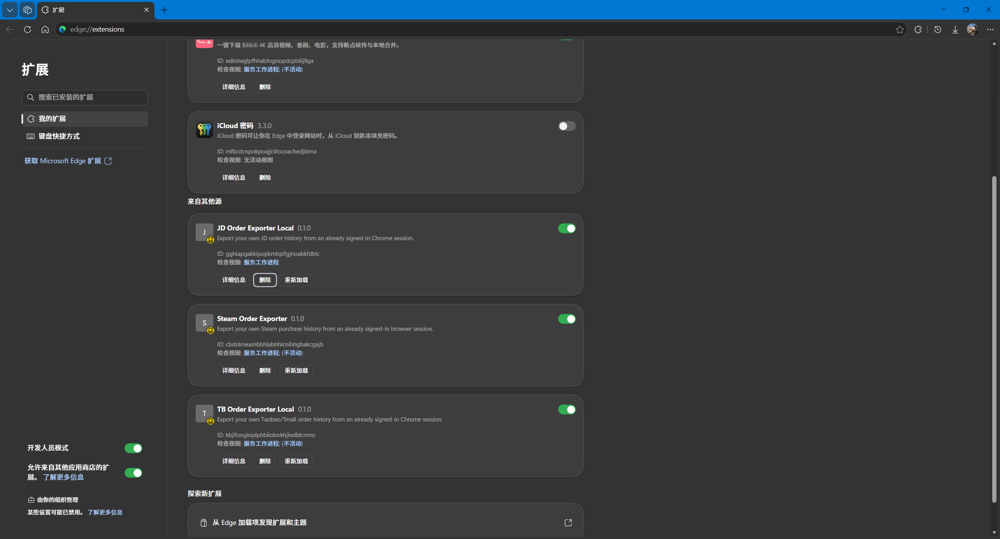

# 📥 批量导入订单数据

!!! tip "⭐ 推荐首选"
    如果你在京东、淘宝、Steam 买过东西，CSV 批量导入是**最快捷**的录入方式；微信 / 支付宝账单（CSV / Excel）同样支持一键导入。导入后系统会自动识别平台、匹配图标、自动去重，不用一条条手打。

!!! warning "导入的文件请保持原始导出状态，不要改动"
    - **不要**用 WPS / Excel 打开后「另存为」或修改内容再保存（会改变文件内部结构，导致无法读取）
    - **不要**手动改文件扩展名（如把 `.xls`、`.zip`、`.html` 硬改成 `.xlsx`）
    - **不要**把微信 / 支付宝邮件里的 **`.zip` 压缩包**直接改名成 `.xlsx`——必须先**解压**，再导入里面的 `.csv` / `.xlsx`
    - 直接导入**刚下载的原始文件**即可（无需打开，也无需转码）

---

## 支持批量导入的平台

支持以下**数据来源平台**的订单 / 账单批量导入（✅ 已勾选 = 当前支持）：

--8<-- "platforms.zh.md"

- **京东 / 淘宝 / Steam** → 见下方「浏览器扩展导入」
- **微信 / 支付宝** → 无需扩展，见下方「微信 / 支付宝账单导入」
- **其它平台**（拼多多 / 闲鱼 / 抖音商城 等）正在规划中，在此之前可先用「手动添加」逐条录入

---

## 📁 各数据源文件格式速查

导入前先看这里，确认你手上的文件是**正确格式**。所有数据源的文件格式都符合通用标准（CSV 文本或 Excel），系统能自动识别，**无需手动改名或转码**：

| 数据源 | 文件格式 | 文件名长这样（示例） | 文件从哪里来 | 会导入什么 |
|------|------|------|------|------|
| 🐶 **京东** | `.csv` 文本 | `jd-orders-20260803-204310-complete.csv` | 浏览器扩展一键导出 | 订单（含商品链接 / 多商品明细） |
| 🛒 **淘宝 / 天猫** | `.csv` 文本 | `tb-orders-20260803-204317-complete.csv` | 浏览器扩展一键导出 | 订单（含商品链接 / 型号款式） |
| 🎮 **Steam** | `.csv` 文本 | `steam-orders-20260803-203151-complete.csv` | 浏览器扩展一键导出 | 游戏购买（自动过滤退款 / 钱包充值） |
| 💬 **微信账单** | `.csv` 或 `.xlsx` | `微信支付账单流水文件(20250101-20260101)_20260804233920.xlsx` | 微信 App「下载账单」→ 邮件压缩包解压 | 支出流水（自动过滤收入 / 退款） |
| 💳 **支付宝** | `.csv` 或 `.xlsx` | 文件名以 `alipay-` / `zfb-` 或「支付宝」开头；否则按内容含「交易订单号」列识别 | 支付宝 App「交易明细」→ 邮件下载 | 支出订单（自动过滤收入 / 退款） |

> ✅ **识别规则**：`jd-`、`tb-`、`steam-`、`wx-`、`alipay-`/`zfb-` 等文件名前缀，以及各平台独有的表头列名（如微信「交易单号」、支付宝「交易订单号」）都能被系统自动识别，所以你只要把**未经修改的原始导出文件**拖进去即可。

!!! warning "支持的扩展名只有 `.csv` 与 `.xlsx`"
    系统（桌面 / 浏览器 / Android）只接收这两类文件：
    - **京东 / 淘宝 / Steam**：仅 `.csv` 文本（浏览器扩展导出的就是 `.csv`，不产生 `.xlsx`）
    - **微信 / 支付宝**：`.csv` 或 `.xlsx` 均可（App 内导出，邮件下载后通常是 `.csv`，也有 `.xlsx`）

    其他格式（`.xls`、`.txt`、`.json`、压缩包 `.zip` 等）**不支持**，导入时会提示「不是 CSV/Excel 文件」。收到的微信压缩包**必须先解压**，取出里面的 `.csv` / `.xlsx` 再导入。

---

## 浏览器扩展导入（京东 / 淘宝 / Steam）

🧩 **装扩展** → 📤 **导出 CSV** → 📥 **拖进日耗仓**

### ① 安装浏览器扩展

支持 **Chrome**、**Edge** 等所有 Chromium 内核浏览器。

[📥 下载浏览器扩展（zip）](assets/dailycost-exporter-extension.zip){: .md-button .md-button--primary }

1. **下载并解压**上面的 zip，得到 `dailycost-exporter-extension` 文件夹（内含 `manifest.json`），别删它
2. 打开浏览器「扩展程序」页，开启「开发者模式」：
   - **Chrome**：地址栏输入 `chrome://extensions/`
   - **Edge**：地址栏输入 `edge://extensions/`
3. 点「**加载已解压的扩展程序**」，选中刚才的文件夹
4. 工具栏出现扩展图标 🧩，就装好了

{ loading=lazy }

> 💡 导出完成后可在扩展管理页移除扩展，不影响已导出的 CSV。**建议用完即删。**

---

### ② 导出订单 CSV

三个平台的操作完全一样，跟着走即可：

1. 登录平台，打开**自己的订单页面**（见下表）
2. 点工具栏的扩展图标 🧩，扩展会**自动识别**当前平台
3. 按提示选好选项（不熟就用默认，也能导出）
4. 点「**开始导出**」，进度显示在页面右下角，完成后自动下载 CSV 文件

| 平台 | 打开这个页面 | 建议的选项 |
|------|--------------|-----------|
| 🛒 淘宝 | [已买到的宝贝](https://buyertrade.taobao.com/trade/itemlist/list_bought_items.htm) | 「订单状态」选「已完成」 |
| 🐶 京东 | [我的订单](https://order.jd.com/center/list.action) | 「日期范围」选「自定义年份范围」按年导出更稳；「订单状态」选「已完成」 |
| 🎮 Steam | [消费历史记录](https://store.steampowered.com/account/history) | 直接点「开始导出」即可 |

> 💡 京东**按年份分段导出**，可降低被风控拦截的概率。文件会自动命名，如 `jd-orders-20260804-103000-complete.csv`（中途停止会变成 `-partial`）。

> ⚠️ Steam 会把退款、钱包充值也一起导出来，**不用管**，导入时系统会自动过滤。

> 🔒 「脱敏收货信息」默认已勾选，保护隐私，一般不用改。

{ loading=lazy }

### 导出的 CSV 文件长什么样

扩展导出的都是**逗号分隔的 UTF-8 文本**，用记事本 / Excel / 任意文本编辑器都能打开查看。三个平台的关键列略有不同，但核心信息（订单号、商品名、金额、时间）都一致：

| 平台 | 文件名（示例） | 关键列 |
|------|------|------|
| 🐶 京东 | `jd-orders-20260803-204310-complete.csv` | `订单编号` `商品名称` `实付金额` `付款时间` `订单状态` `商品明细JSON`（→ 提取商品链接） |
| 🛒 淘宝 / 天猫 | `tb-orders-20260803-204317-complete.csv` | `订单编号` `商品名称` `实付金额` `付款时间` `订单状态` `商品链接` `型号款式` |
| 🎮 Steam | `steam-orders-20260803-203151-complete.csv` | `交易ID` `物品名称` `类型` `总计` `日期` |

!!! tip "文件名的含义"
    以 `jd-orders-20260803-204310-complete.csv` 为例：`jd-` 是平台标识，`20260803-204310` 是导出时间，`complete` 表示完整导出（中途停止会变成 `-partial`）。**平台标识和文件名都由扩展自动生成，你只需拿到一个 `.csv` 文件即可导入**，不需要自己改名。

    > ℹ️ 这三个平台**只支持 `.csv` 文本**，不支持 `.xlsx`。

---

### ③ 导入到日耗仓

拿到 CSV 后，两种方式任选：

- **拖拽（推荐）** — 直接把 CSV 文件拖进设置页的「数据导入」区域，一次可拖多个
- **选择文件** — 设置页 → 「数据导入」→ 点「📄 选择 CSV 文件」，按住 ++ctrl++ 多选

{ loading=lazy }

导入完会提示「**成功导入 X 条，跳过 X 条**」。「跳过」表示该订单已存在或不符合条件，系统已自动去重，不用担心。

---

## 微信账单导入（无需扩展）

微信账单可以直接在微信 App 内导出，**不需要安装浏览器扩展**，导出的是 CSV / Excel 文件，拖进日耗仓即可导入：

1. 打开微信 → **我** → **服务** → **钱包**
2. 点击右上角 **「账单」**
3. 点击右上角 **「常见问题」**
4. 点击 **「下载账单」**
5. 选择 **「用于个人对账」**
6. 选择账单的**交易类型**和**时间范围**，点击「下一步」
7. 输入**邮箱地址**并提交，微信会把账单下载链接发送到该邮箱
8. 登录邮箱下载账单**压缩包**，**解压**出里面的 CSV / Excel 文件，再拖入日耗仓（或在设置页点「选择文件」导入）

> 📖 详细图文操作可参考：[微信账单 excel 如何导出 - 百度经验](https://jingyan.baidu.com/article/0eb457e5dee27d42f0a90568.html)

### 微信账单文件长什么样

邮件里的压缩包解压后，得到一个 **`.csv` 或 `.xlsx`** 文件（可用 Excel / 表格软件打开）。文件名形如：

`微信支付账单流水文件(20250101-20260101)_20260804233920.xlsx`

文件的**前十几行是元数据说明**（微信昵称、时间范围、收支统计等），元数据之后才是真正的表头和数据行，表头列如下：

| 列名 | 含义 |
|------|------|
| `交易单号` | 唯一标识，用于去重 |
| `商户单号` | 商户侧订单号 |
| `交易时间` | `YYYY-MM-DD HH:MM:SS` |
| `交易对方` | 商家名称 |
| `商品` | 商品名（为空时自动回退为「交易对方」） |
| `收/支` | 区分支出 / 收入 |
| `金额(元)` | 金额 |
| `支付方式` / `备注` | 合并进型号区 |
| `当前状态` / `交易类型` | 用于过滤 |

!!! note "不用管开头的元数据"
    文件开头的「微信昵称」「起始时间」「共 N 笔记录」「交易时间 / 交易类型 / …」等提示行会被系统自动跳过。你只需要把**整个 `.csv` / `.xlsx` 文件**拖进日耗仓即可，系统会自动定位到真正的数据表头。

### 微信账单导入规则：保留 vs 过滤

导入时系统会自动区分数据，让你清楚知道哪些**保留入库**、哪些**被过滤**：

**✅ 保留（入库）**

- **仅导入「支出」流水**（`收/支` = 支出）
- **状态白名单放行**：支付成功 / 已支付 / 交易成功 / 完成 / 已转账 / 对方已收钱 / 空
- **不按「交易类型」过滤**：转账、红包、扫码付款、群收款、亲属卡等**非购物流水同样保留入库**，帮你看到日常支出全貌（商品名为空时自动回退为「交易对方」）
- 金额自动取绝对值；支付方式 + 备注自动合并到型号区；按「交易单号」自动去重

**❌ 过滤（跳过）**

- **收入 / 不计收支** 等非支出流水
- **退款或异常状态**：已全额退款、已退款(¥X)、对方已退还 等
- 交易单号为空、金额 ≤ 0、或与已有记录重复的数据

---

## 支付宝账单导入（无需扩展）

支付宝交易明细可以直接在支付宝 App 内导出，**不需要安装浏览器扩展**，导出的是 CSV / Excel 文件，拖进日耗仓即可导入：

1. 打开支付宝 App → **我的** → 右上角 **「设置」** → **「账单」**（或直接在首页点「账单」）
2. 点击账单页右上角的 **「···」→「开具交易流水证明」**（部分版本在「交易记录」右上角）
3. 选择 **「用于个人对账」**，然后选择要导出的**时间范围**
4. **务必勾选全部信息**：导出设置中请勾选「**展示交易对手信息**」「**展示商品说明信息**」等所有可选项——只有勾选了这些，导出的明细才包含「交易对方」「商品说明」列，导入后商品名、店铺名才完整可读
5. 填写**邮箱地址**并提交，支付宝会把交易明细文件发送到该邮箱（部分版本可直接在 App 内下载）
6. 登录邮箱下载文件，拖入日耗仓（或在设置页点「选择文件」导入）

> 📖 详细图文操作可参考：[【杭州】支付宝账单流水导出方法的图文教程，记得收藏！ - 知乎](https://zhuanlan.zhihu.com/p/1925479803248697933)
### 支付宝账单文件长什么样

支付宝导出的文件是 **`.csv` 或 `.xlsx`**，文件名通常含「交易明细」，或带 `alipay-` / `zfb-` 前缀。文件**前二十行左右是元数据和一条分隔虚线**，分隔线之后才是真正的表头和数据行，表头列包括：

| 列名 | 含义 |
|------|------|
| `交易订单号` | 唯一标识，用于去重 |
| `商家订单号` | 商户侧订单号 |
| `交易时间` | `YYYY-MM-DD HH:MM:SS` |
| `商品说明` / `产品说明` | 商品名（为空时自动回退：交易对方 → 交易分类 → 对方账号） |
| `交易对方` | 店铺名 |
| `收/支` | 区分支出 / 收入 |
| `金额` | 金额 |
| `收/付款方式` / `备注` | 合并进型号区 |
| `交易状态` / `交易分类` | 用于过滤 |
> ⚠️ 支付宝导出的 CSV 可能是 **GBK 编码**（Windows 打开正常、直接拖入会乱码），日耗仓会自动识别编码并正常导入，无需手动转换。

### 支付宝账单导入规则：保留 vs 过滤

**✅ 保留（入库）**

- **仅导入「支出」订单**（`收/支` = 支出）
- **状态白名单放行**：交易成功 / 支付成功 / 空
- 商品名自动取「商品说明」，为空时逐级回退「交易对方 → 交易分类 → 对方账号」；店铺名回退「交易对方 → 对方账号 → 交易分类」
- 金额自动取绝对值；收/付款方式 + 备注自动合并到型号区；按「交易订单号」自动去重

**❌ 过滤（跳过）**

- **收入 / 不计收支 / 退款** 等非支出流水（退款、转账、提现、余额宝收益等）
- **异常状态**：退款成功、交易关闭、解冻 等
- 交易订单号为空、金额 ≤ 0、或与已有记录重复的数据

> 💡 **强烈建议勾选全部信息列**。支付宝导出时允许勾选/取消导出列：不勾选「商品说明」「交易对方」等列虽然也能导入，但商品名、店铺名会降级为「交易分类 / 对方账号」（可读性较差）；全部勾选才能得到最完整的商品名与店铺名。

!!! note "关于京东 / 淘宝订单与微信 / 支付宝账单的重复记账"
    日耗仓的去重是**同平台 + 跨平台双重**的：同平台按「订单编号 / 交易单号」去重；同时支持**跨平台自动去重**——微信可以支付淘宝 / 京东、支付宝可以支付淘宝，同一笔消费会同时出现在平台订单 CSV 与支付账单中。系统会把「账单商家单号以平台订单号为后缀 且 金额一致」的记录判定为同一笔消费并自动跳过，避免重复记账。

    两种导入顺序都不会重复记账（导入结果会提示「跨平台重复 N 条」），但**推荐先导入京东 / 淘宝订单 CSV、再导入微信 / 支付宝账单**：跨平台去重会保留**先导入**的那条记录，而平台订单 CSV 含**商品链接、商品编号、多商品明细**等更完整的信息（账单只有商家订单号、没有商品链接），先导平台订单能留下信息更全的记录。实测约 1/4 的支付宝支出（淘宝订单）可借此补全商品信息；其余为交通 / 餐饮 / 华为等日常流水，账单是唯一数据源，导入顺序无关。

    **建议**：以平台自身导出的订单（京东 / 淘宝 CSV）为数据源，微信 / 支付宝账单主要用于补充平台无法导出的日常支出。

---

## 导入后，系统自动帮你做了这些

- ✅ 识别平台（京东 / 淘宝 / Steam / 微信 / 支付宝）并匹配 emoji 图标
- ✅ 只导入已完成的订单（待付款、已取消等自动跳过）
- ✅ 同一平台 + 同一订单号自动去重，不重复导入
- ✅ 同一笔订单的多件商品自动展开
- ✅ 提取京东商品的详情链接

---

## 安全提示

!!! warning "数据安全"
    - 🔒 扩展**只在你本机浏览器中运行**，不会上传任何数据到第三方
    - 扩展不读取你的 cookie、密码或其他站点数据
    - 导出完成后可随时移除扩展
    - 别把导出的 CSV 发给别人或传上网

---

## 下一步

导入完成后，前往 **[📋 浏览与管理资产](manage-items.md)** 查看、筛选和编辑你的物品。
