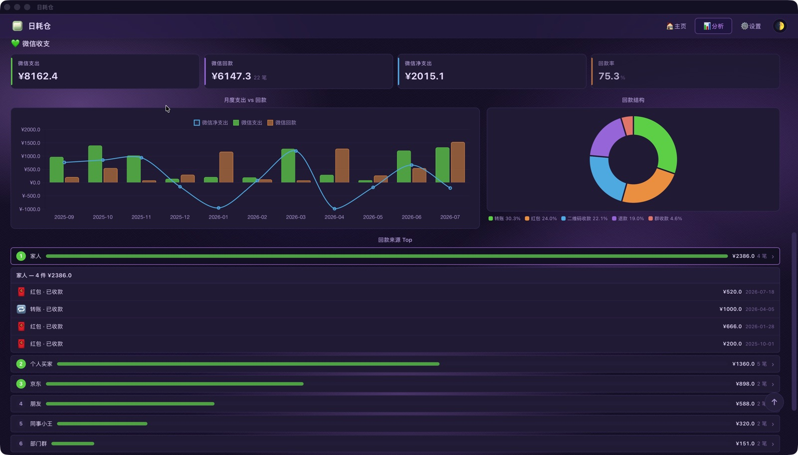

---
hide:
  - navigation
  - toc
title: DailyCost Vault
---

DailyCost Vault

Bulk import, yours to control

Every item has a daily average cost. Your asset ledger — know the real cost of every item.

  <a href="getting-started/" class="md-button md-button--primary hero-btn">
    Quick Start
  </a>
  <a href="https://github.com/Lizhenghe-Chen/BunnyChen-DailyCost" class="md-button hero-btn" target="_blank" rel="noopener">
    GitHub Repo
  </a>

{ loading=lazy }

{ loading=lazy }

{ loading=lazy }

{ loading=lazy }

{ loading=lazy }

!!! tip "🎁 30-Second Quick Experience"
    Don't want to import? Open the app and click "**Load sample data**" on the empty state — see a full asset wall and analytics in 30 seconds. Clear it anytime.

<!-- Feature badges -->

  🪟 Cross-Platform
  🔒 Local Storage
  🎨 Multi-Theme
  😀 Custom Emoji
  🌍 Multi-Language

<!-- Video Introduction -->

📺 Video Introduction

  <iframe src="https://player.bilibili.com/player.html?isOutside=true&aid=117063712639931&bvid=BV1KZu16eE3v&cid=40738687283&p=1" scrolling="no" border="0" frameborder="no" framespacing="0" allowfullscreen="true"></iframe>

<!-- Batch-import platforms -->

📥 One-Click Batch Import · Four Platforms

🐶 JD.com
🛒 Taobao / Tmall
🎮 Steam
💬 WeChat Bills

Auto platform detection · Auto emoji matching · Auto deduplication — [📥 Import Guide](import-csv.md)

---

## Core Innovation

### 🧮 Daily Average Cost

An item costing ¥1000 used for 1000 days costs only ¥1/day. An item costing ¥100 used only once costs ¥100/day.

Cheap ≠ economical. Expensive ≠ wasteful. DailyCost Vault independently calculates the daily average cost for every item — across In Use, Sold, and Retired states — making "money-burning" assets visible at a glance.

### 📥 Smart Import from 5 Platforms

Drag and drop JD.com, Taobao, and Steam order CSVs, plus WeChat and Alipay bills (CSV / Excel). Dual parser (Rust backend + TypeScript frontend), auto platform detection, invalid order filtering, emoji matching, multi-item merge, auto GBK encoding detection for Alipay exports, and graceful handling when columns are filtered out. Batch preload deduplication — tens of thousands of records imported in seconds.

### 🔒 Fully Local Data

SQLite database with local persistence, zero server dependency. Your spending data never leaves your device. No user accounts, no cloud sync, no telemetry. Export backups anytime.

---

## Interface Preview

{ loading=lazy }

**Asset Cards · Spot Money-Burners at a Glance** — Stats bar, keyword search, multi-dimensional filtering, flexible sorting. Green = earned back, Red = burning money. Every item's value is clear.

{ loading=lazy }

**Analytics · Understand Your Spending** — Monthly spending chart with platform/time filters and chart toggle. Bar chart drill-down to see monthly items. Dual pie charts for platform and category on one screen.

{ loading=lazy }

**Multi-Dimensional Filtering · Precise Targeting** — Multi-platform checkboxes, fuzzy keyword search, 3-axis sorting combined. Find any item in seconds.

{ loading=lazy }

**Custom Emoji · Thousands to Choose** — Full emoji-mart Unicode emoji set + 37 custom emojis (Party Parrots / Blob / Cats / Mascots across 4 categories). Pick directly in the picker.

{ loading=lazy }

**Settings · Your Tool, Your Way** — 3-state theme, 5 color schemes, custom platform colors, 3-language switch, independent currency symbol. Deeply customize every detail.

{ loading=lazy }

**Analytics · Dark Theme** — Four KPI cards overview your asset landscape. Monthly spending trends and platform breakdown at a glance, clear and readable even in dark theme.

{ loading=lazy }

**WeChat Cash Flow · Daily Spending in Focus** — After importing WeChat bills, the analytics page adds a WeChat section: expenses / cashback / net spending at a glance, with cashback structure, Top 10 sources, and monthly trends.

---

## Cross-Platform · One Codebase

### 🪟 Windows

`.exe` / `.msi`

### 🍎 macOS

`.dmg` · Apple Silicon & Intel

### 🐧 Linux

`.deb` / `.AppImage`

### 📱 Android

`.apk`

### 🌐 Web

[Works in browser](https://bunnychen.top/BunnyChen-Item-Bookkeeping/)

---

## Tech-Driven

### 🦀 Rust Backend

Tauri v2 framework, 29 Rust commands handling all data operations. SQLite WAL mode, foreign key constraints, automatic database migration. Daily cost calculated dynamically on every query — formula updates without re-importing.

### ⚡ Ultra Lightweight

Windows installer ~5MB. Vanilla TypeScript frontend, zero framework dependencies. 30× lighter than Electron alternatives. Ready on launch, no background resource consumption.

### 🔄 Auto Update

Tauri updater silent download & install + GitHub API cross-platform version detection. Auto-check on launch, manual check anytime. Signature verification ensures update security.

### 🎨 Custom Emoji

Thousands of emojis at your fingertips — full emoji-mart Unicode emoji set + 37 custom emojis. Party Parrots animated GIFs, Blob inline SVGs, Cats, Mascots across 4 categories. Pick directly in the picker.

### 🌍 Trilingual i18n

简体中文, 繁體中文, English — instant switching covering the entire interface. Currency symbol and interface language independently configurable. i18next-powered, JSON translation files.

### ♻️ Sustainable Data

Daily cost formulas, emoji matching rules, and category keywords are all hot-updatable. Legacy data auto-backfills — algorithm iterations never require re-importing historical data.

---

## 🔒 Privacy & Security · A Solemn Promise

**DailyCost Vault runs fully offline and stores all data locally. Never collect, upload, or peek into any of your data.**

**Where your data lives**

- 🖥️ Desktop → SQLite database in the `AppData` directory
- 🤖 Android → SQLite database in the app's private directory
- 🌐 Web → Browser localStorage

**What is never done**

🚫 No data upload
🚫 No tracking analytics
🚫 No reading unrelated files
🚫 No user accounts
🚫 No cloud sync

> 🗝️ **The project is not open source yet, but BunnyChen promises never to collect, upload, or snoop on any of your data.** Your data belongs only to you — please keep it safe.

---

## Five Themes · Five Personalities

🎠 Auto-rotating · Swipe or click dots to switch

{ loading=lazy }

**🍵 Matcha Green** — Calm and healing, close to nature. Default color scheme with independent light/dark mode designs.

{ loading=lazy }

**☁️ Sky Blue** — Clean and airy, bright yet restrained. Consistent across desktop and mobile.

{ loading=lazy }

**🫐 Berry Purple** — Mysterious and sophisticated, boldly distinctive. Settings and emoji pages deeply integrated.

{ loading=lazy }

**🍑 Peach Pink** — Soft and sweet, warmly inviting. Desktop light theme shines equally bright.

{ loading=lazy }

**🍊 Tangerine Orange** — Energetic and vibrant, full of passion. Asset home page in dark mode.

---

## Quick Start — See Your Data in 3 Steps

**Data-driven · Import beats manual entry** — No need to type every record by hand. Export your orders from each platform, import them in bulk, and the data organizes itself into asset cards. Manual entry barely covers a handful per day; bulk import gets thousands of orders into your library in seconds.

### Download & Install

Go to [Releases](https://github.com/Lizhenghe-Chen/BunnyChen-DailyCost/releases) to choose your platform installer, or open the [Web version](https://bunnychen.top/BunnyChen-Item-Bookkeeping/) directly. Windows: `.exe` recommended. macOS: download `.dmg`.

[Getting Started →](getting-started.md)

### Import Data

Install [browser extensions](assets/dailycost-exporter-extension.zip) to export JD.com, Taobao, and Steam purchase history as CSV, or export WeChat bills directly from the WeChat app. Drag them into the app window or click import in Settings — auto-parse, deduplicate, and categorize.

[Download the Browser Extension](assets/dailycost-exporter-extension.zip){: .md-button .md-button--primary } · [Import Guide →](import-csv.md)

### All Set

The home page card grid displays all items. Green = earned back. Red = burning money. Click cards for details, go to Analytics for monthly trends and platform breakdown. Start rethinking every purchase you make.

[Manage Assets](manage-items.md) · [Analytics](analytics.md)

## Start Your Asset Digitalization Journey

Free · Open Beta · Data Fully Local

[Quick Start](getting-started.md){: .md-button .md-button--primary }

*Source code is not public yet · All Rights Reserved*
