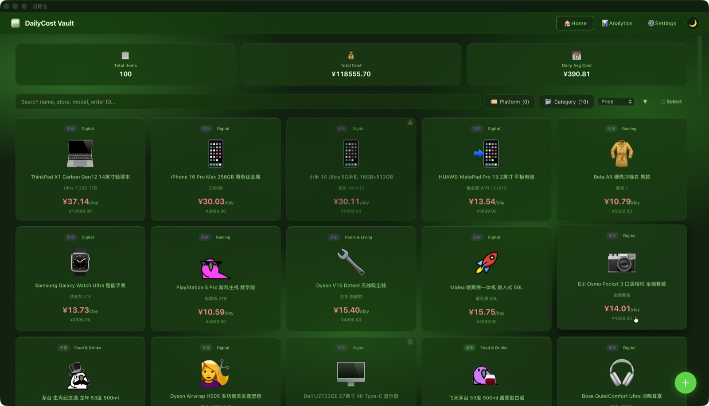
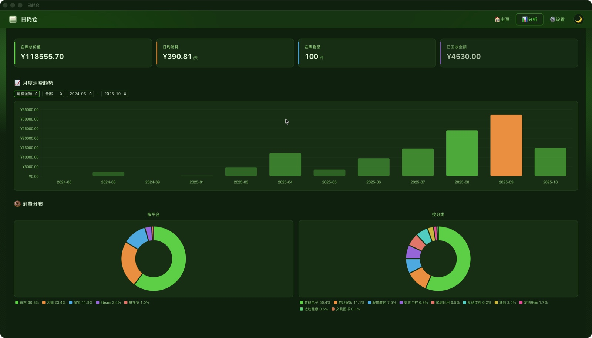
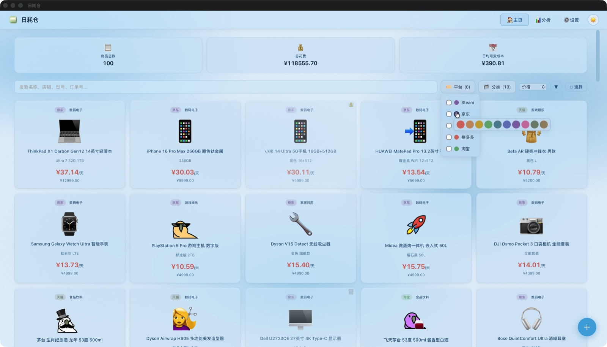
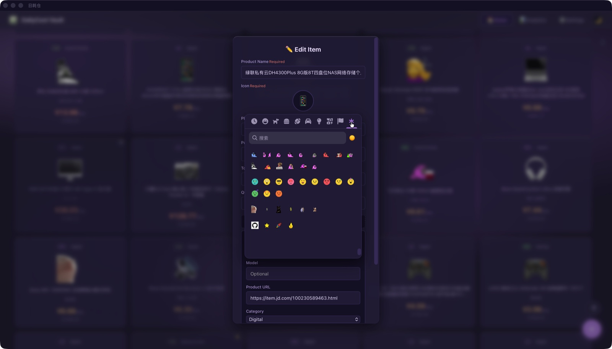
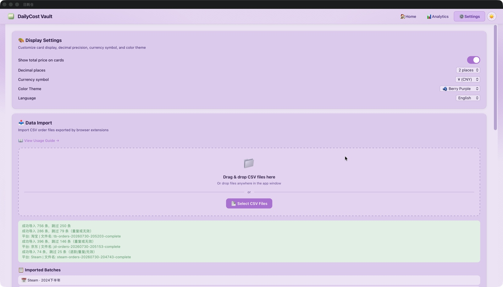
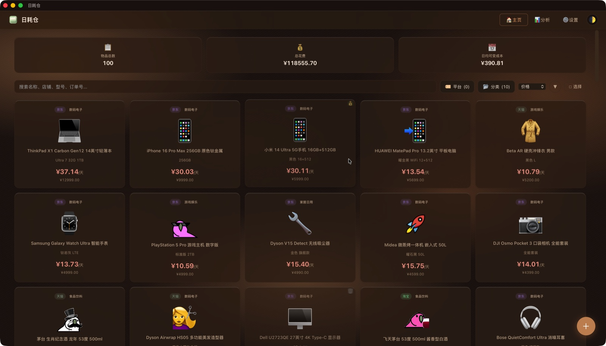
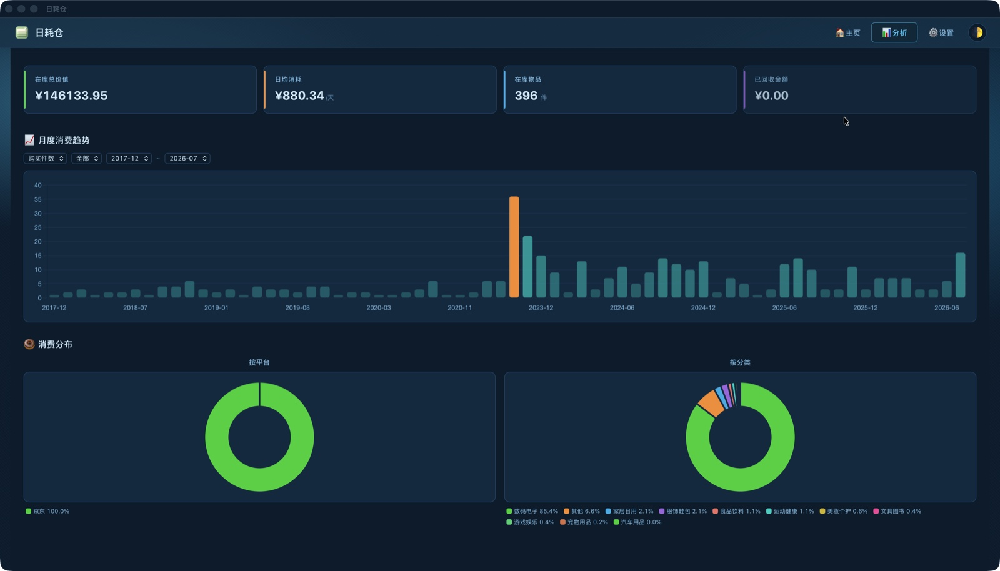
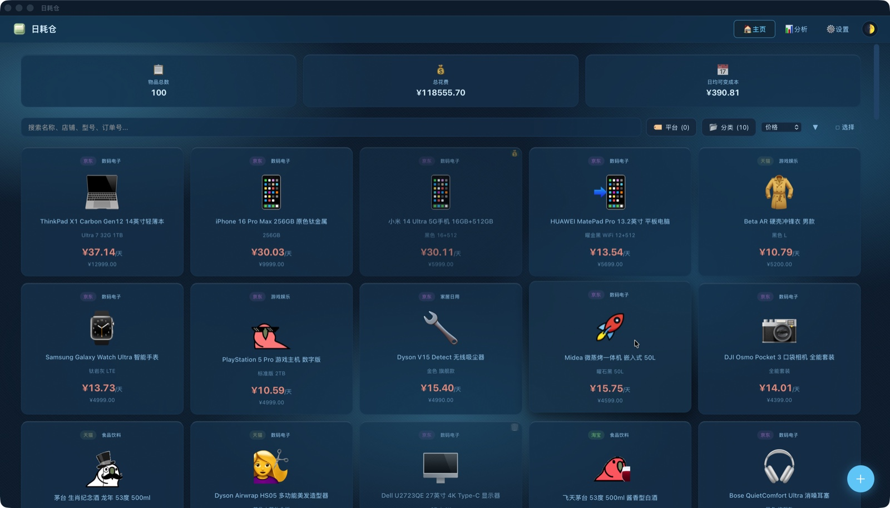
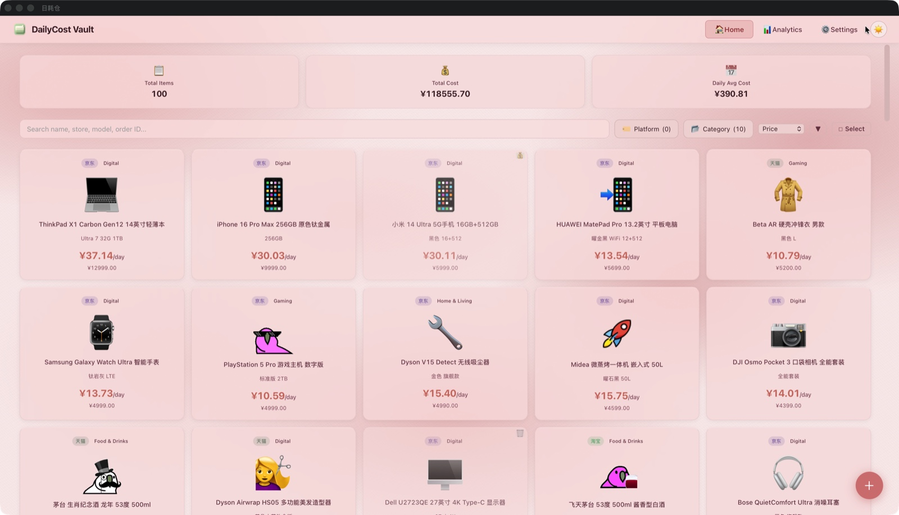
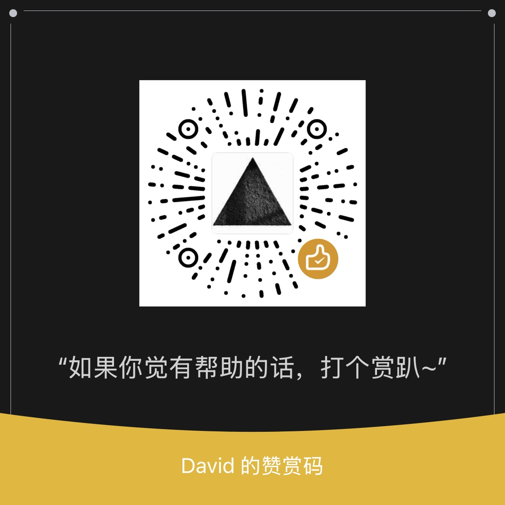

---
hide:
  - navigation
  - toc
title: 日耗仓 · DailyCost Vault
---

日耗仓 · DailyCost Vault

重新理解你花的每一分钱

每一件物品都有日均持有成本。长期主义个人资产数字化管理工具。

  <a href="https://github.com/Lizhenghe-Chen/BunnyChen-DailyCost/releases" target="_blank" class="md-button md-button--primary hero-btn">
    立即下载
  </a>
  <a href="getting-started/" class="md-button hero-btn">
    使用指南
  </a>

{ loading=lazy }

{ loading=lazy }

{ loading=lazy }

{ loading=lazy }

{ loading=lazy }

<!-- 功能标签条 -->

  🪟 全平台支持
  🔒 数据本地存储
  🎨 多主题配色
  😀 emoji 自定义
  🌍 三语界面

---

## 核心创新

### 🧮 日均持有成本

一件 ¥1000 的东西用了 1000 天，每天只花 ¥1。一件 ¥100 的东西只用了一次，每天 ¥100。

便宜不等于划算，贵不等于浪费。日耗仓为每一件物品独立计算日均持有成本——使用中、已售出、已报废，三种场景自动适配，一眼识别「烧钱」资产。

### 📥 三平台智能导入

京东、淘宝、Steam 订单 CSV 拖入即导入。Rust 后端与 TypeScript 前端双解析器，自动识别平台、过滤无效订单、emoji 匹配、多商品合并。批量预加载去重，万条数据秒级入库。

### 🔒 数据完全本地

SQLite 数据库本地持久化，零服务器依赖。你的消费数据永远不会离开你的设备。无用户系统、无云同步、无遥测追踪。数据随时可导出备份。

---

## 界面预览

{ loading=lazy }

**资产卡片 · 一眼识别烧钱资产** — 顶部统计栏、关键词搜索、多维筛选、灵活排序。绿色 = 用回本，红色 = 在烧钱，每件物品的价值一目了然。

{ loading=lazy }

**数据分析 · 洞察消费结构** — 月度消费图表支持平台 / 时间筛选与图表切换，柱状图可下钻查看当月商品，平台与分类双饼图一屏尽览。

{ loading=lazy }

**多维筛选 · 精准定位** — 平台多选过滤、关键词模糊搜索、三维排序叠加使用，秒级定位任意一件物品。

{ loading=lazy }

**自定义表情 · 数千个 emoji 可选** — emoji-mart 全量 Unicode 表情 + 37 个自定义表情（Party Parrots / Blob / Cats / Mascots 四大分类），Picker 中直接选用。

{ loading=lazy }

**个性化设置 · 你的工具你做主** — 三态主题、5 套配色、平台自定义颜色、三语切换、货币符号独立设置，深度定制每一项细节。

{ loading=lazy }

**数据分析 · 深色主题** — KPI 四卡片概览资产全景，月度消费趋势与平台占比一目了然，深色主题下依旧清晰易读。

---

## 全平台 · 一套代码

### 🪟 Windows

`.exe` / `.msi`

### 🍎 macOS

`.dmg` · Apple Silicon & Intel

### 🐧 Linux

`.deb` / `.AppImage`

### 📱 Android

`.apk`

### 🌐 Web

浏览器即用

---

## 技术驱动

### 🦀 Rust 后端

Tauri v2 框架，29 个 Rust 命令处理全部数据操作。SQLite WAL 模式、外键约束、自动数据库迁移。日均成本每次查询动态计算，修改公式无需重新导入。

### ⚡ 极致轻量

Windows 安装包约 5MB。Vanilla TypeScript 前端，零框架依赖。对比 Electron 方案轻 30 倍以上。启动即用，不占用后台资源。

### 🔄 自动更新

Tauri updater 静默下载安装 + GitHub API 全平台版本检测。启动后自动检查，也可随时手动触发。签名验证保障更新安全。

### 🎨 自定义表情

数千个 emoji 随时选用——emoji-mart 全量 Unicode 表情 + 37 个自定义表情，Party Parrots 动画 GIF、Blob 内联 SVG、Cats、Mascots 四大分类。Picker 中直接选用。

### 🌍 三语国际化

简体中文、繁體中文、English 即时切换，覆盖全部界面。货币符号与界面语言独立设置。i18next 驱动，JSON 翻译文件。

### ♻️ 数据可持续

日均成本公式、emoji 匹配规则、分类关键词均可热更新。旧数据自动回填，算法迭代无需重新导入历史数据。

---

*源码可审计：[github.com/Lizhenghe-Chen/BunnyChen-Item-Bookkeeping](https://github.com/Lizhenghe-Chen/BunnyChen-Item-Bookkeeping) · 许可：PolyForm Noncommercial 1.0.0（禁止商用）*

---

## 五套主题 · 五种气质

🎠 自动轮播 · 左右滑动或点击圆点切换

{ loading=lazy }

**🍵 抹茶绿** — 沉稳治愈，亲近自然。默认配色，浅色 / 深色双模式独立设计。

{ loading=lazy }

**☁️ 天之蓝** — 清爽通透，明亮克制。桌面与移动端一致适配。

{ loading=lazy }

**🫐 莓之紫** — 神秘高级，个性鲜明。设置页与表情页深度融入。

{ loading=lazy }

**🍑 桃之粉** — 温柔甜美，暖意十足。桌面端浅色主题同样出彩。

{ loading=lazy }

**🍊 橘之橙** — 活力四射，热情洋溢。深色模式下的资产首页。

---

## 快速开始

### 下载安装

前往 [Releases](https://github.com/Lizhenghe-Chen/BunnyChen-DailyCost/releases) 选择对应平台安装包，或直接打开[网页版](https://bunnychen.top/BunnyChen-Item-Bookkeeping/)。Windows 推荐 `.exe`，macOS 下载 `.dmg`。

### 导入数据

安装[浏览器扩展](https://github.com/Lizhenghe-Chen/BunnyChen-DailyCost/tree/main/dailycost-exporter-extension)导出京东、淘宝、Steam 消费记录为 CSV。拖入应用窗口或设置页点击导入——自动解析、去重、分类。

[📦 获取浏览器扩展](https://github.com/Lizhenghe-Chen/BunnyChen-DailyCost/tree/main/dailycost-exporter-extension){: .md-button .md-button--primary }

### 一切就绪

主页卡片网格展示所有物品。绿色 = 用回本，红色 = 在烧钱。点击卡片查看详情，进入分析页查看月度趋势和平台占比。开始重新认识你的每一笔消费。

---

## 支持一下 · 请我喝杯咖啡 ☕

一个人维护不易，喜欢的话，请我喝杯咖啡吧～ 🥺

{ width="140" loading=lazy }

{ width="140" loading=lazy }

**☕ Buy Me a Coffee**

[{ width="190" loading=lazy }](https://buymeacoffee.com/bunnychen)

buymeacoffee.com/bunnychen

**🧧 微信赞赏**

{ width="190" loading=lazy }

微信扫码 · 金额随心

> 📬 商务合作 / 企业定制 / 平台接入：欢迎通过上方赞赏入口联系

---

## 开始你的资产数字化之旅

免费 · 开放测试 · 数据完全本地

[前往下载](https://github.com/Lizhenghe-Chen/BunnyChen-DailyCost/releases){: .md-button .md-button--primary target="_blank"}
&nbsp;
[阅读使用指南](USER_GUIDE.md){: .md-button }

