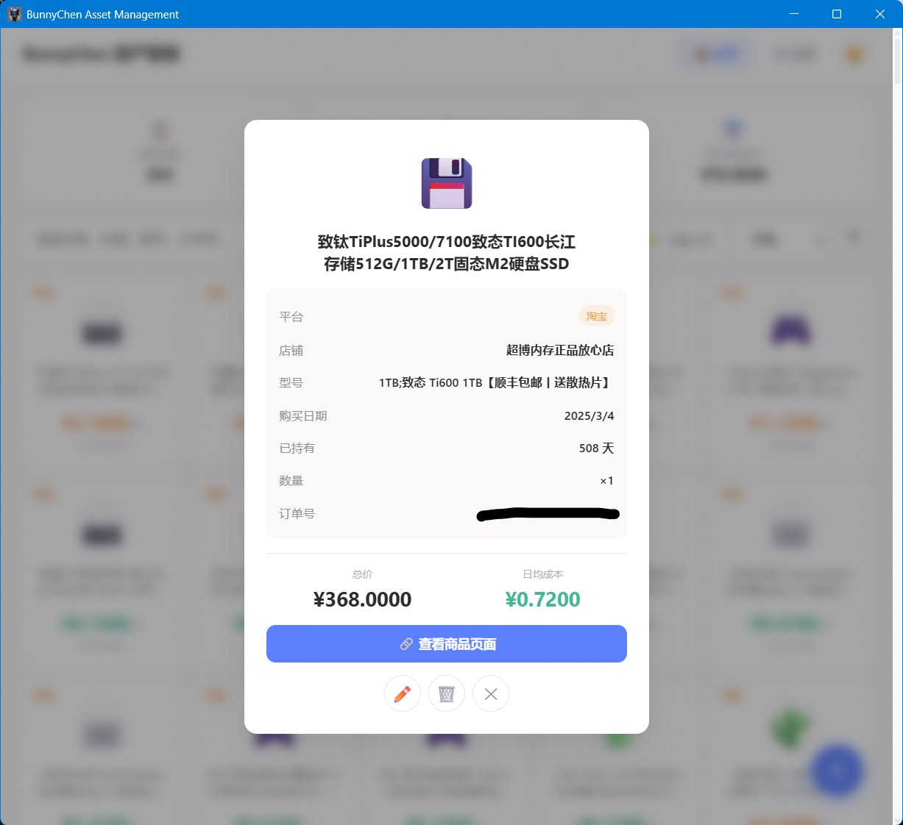

# 📋 Browse & Manage Assets

After importing data, you can browse all asset cards on the home page, filter, view details, edit, archive, and more.

---

## Home Page Layout

The home page is the core interface, consisting of the following areas:

```text
┌──────────────────────────────┐
│  📋 Item Count  💰 Total  📅 Daily Cost │  ← Stats bar
├──────────────────────────────┤
│  🔍 Search  [Platform▼]  [Sort▼] [▲▼] │  ← Filter & search bar
├──────────────────────────────┤
│  ┌──────┐ ┌──────┐ ┌──────┐ │
│  │Card 1│ │Card 2│ │Card 3│ │  ← Card grid
│  └──────┘ └──────┘ └──────┘ │
│  ┌──────┐ ┌──────┐          │
│  │Card 4│ │Card 5│  ...     │
│  └──────┘ └──────┘          │
├──────────────────────────────┤
│  🏠Home  📊Analytics  ⚙️Settings│  ← Bottom nav
└──────────────────────────────┘
                              ➕  ← Floating action button
```

{ loading=lazy }

!!! tip "Card Information"
    Each card shows the **platform badge** (top-left), item name and emoji icon (center), and **daily average cost** (bottom — total price display is configurable). The longer you hold an item, the lower its daily cost — this is the "long-term thinking" data proof.

---

## Filter & Search

As your items grow, use filters and search to quickly find what you need:

| Control | Function | How to Use |
|---------|----------|------------|
| 🔍 Search | Fuzzy search by name, store, model, order ID | Type keywords for real-time filtering; ✕ button to clear |
| 🏷️ Platform Filter | Filter by e-commerce platform | Click dropdown, check/uncheck platforms |
| 📊 Sort By | Sort by time/price/daily cost | Dropdown to select sort field |
| ▲▼ Direction | Toggle ascending/descending | Click arrow button to toggle |

{ loading=lazy }

> 💡 Search supports **order ID lookup**. Can't remember which store you bought from? Just search the order number.

> 💡 When search or filters return no results, the page shows contextual guidance (keyword-only / platform-only / combined) with a "Clear All Filters" button.

---

## Manually Add Items

For individual items or platforms not yet supported for batch export.

1. Click the **➕ FAB** (floating action button) at bottom-right
2. Fill in the item details in the form:

| Field | Required | Description |
|-------|:--------:|-------------|
| Product Name | ✅ | Item name, e.g., "iPhone 16 Pro" |
| Icon | — | Click to choose an emoji icon; custom emojis supported |
| Platform | ✅ | Dropdown selection, or type a custom platform (e.g., "Xianyu", "Dewu") |
| Purchase Date | ✅ | Used to calculate holding days |
| Total Price | ✅ | Actual amount paid |
| Quantity | ✅ | Number of items |
| Store | — | Store name |
| Model/Variant | — | Color, specs, etc. |
| Product Link | — | E-commerce product link |
| Status | — | In Use / Sold / Retired |

3. Click "**Save**" — the system auto-calculates daily cost and generates an asset card

{ loading=lazy }

### Status Types

| Status | Description | Extra Fields |
|--------|-------------|-------------|
| In Use | Currently in normal use | — |
| Sold | Resold second-hand | End date, sale price |
| Retired | No longer usable or discarded | End date |

> 💡 **Sold status**: When marked as sold, the system calculates actual net cost = (Purchase Price − Sale Price) ÷ Days Held. Profit shows in green. Know exactly what your used items are worth!

---

## Item Details & Editing

Click any card to open the detail popup, showing complete information:

- **Basic Info**: Name, platform, emoji icon
- **Cost Data**: Purchase price, daily average cost, days held
- **Supplementary Info**: Store, model/variant, product link
- **Status**: In Use / Sold / Retired, with end date and sale price

{ loading=lazy }

In the detail popup you can:

| Action | Button | Description |
|--------|:------:|-------------|
| 📝 Edit | "Edit" button | Modify any field of the item |
| 📦 Archive | "📦" button | Hide from home page (data preserved) |
| 🗑️ Delete | "🗑️" button | Permanent deletion (archived items only) |

---

## Archive Management

Archiving is a "soft delete" mechanism — items are hidden from the home page but data is permanently preserved.

### Archive an Item

Click the "📦" button in the item detail popup — the item disappears from the home page and moves to the archive list in Settings.

### Unarchive

In the Settings page's "Archive Management" section, find the archived item and click "📥" to restore it to the home page.

### Permanent Delete

Only archived items can be permanently deleted. In the item detail popup, click "🗑️" and confirm — this cannot be undone.

!!! warning "Permanent deletion is irreversible"
    Make sure you really don't need the item before confirming.

---

## Batch Operations

When you need to process multiple items at once:

1. Click "**Select**" on the home page to enter batch selection mode
2. Check the item cards you want to operate on
3. A batch action bar appears at the bottom — click "Batch Archive" to process all at once

The Settings archive management also supports batch "Unarchive" and "Batch Delete".

---

## Quick Actions

| Action | Method |
|--------|--------|
| Close popup | Click overlay / click ✕ / press ++esc++ |
| Back to top | ↑ button appears at bottom-right after scrolling 400px+ |
| Clear search | ✕ button on search bar |
| Quick theme switch | 🌓 button in top nav bar |

---

## Next Steps

Check out **[📊 Analytics](analytics.md)** to understand your spending patterns and trends.
